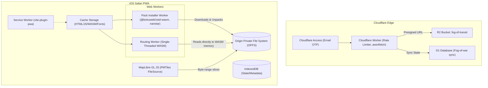

# Dérivée Web: Architecture Decision Record

## System Overview

Dérivée Web is an offline-first PWA transit app for iOS Safari. It leverages WebAssembly for offline routing, PMTiles for offline maps, and Cloudflare's edge for private distribution and sync.



## Architecture Decision Records

### 1. Storage: OPFS for Large Binaries
**Decision:** Store the 55 MB of routing binaries (`walk_graph.bin`, `timetable.bin`, `transit.sqlite`) and the ~22 MB basemap (`nyc-basemap.pmtiles`) in the Origin Private File System (OPFS), bypassing the Service Worker and Cache Storage for these data payloads.
**Context:** iOS Safari imposes strict memory and execution limits. Service Worker `install` events time out after 30-45s, making it fatal to precache a 28 MB archive there. IndexedDB has high serialization overhead for large binary blobs.
**Alternatives considered:** 
- Cache Storage: Fails on Safari due to Range request bugs and memory spikes when loading full blobs.
- IndexedDB: 3x-5x slower than OPFS, triggers IPC serialization timeouts on iOS.
**Consequences:** Requires custom application-level foreground logic to download, decompress, and unpack the data into OPFS using `FileSystemSyncAccessHandle`.
**What would change the decision:** If Apple deprecates OPFS or adds native `mmap` capabilities to WASM/JavaScript.

### 2. WASM Engine: Single-Threaded, Pre-Allocated, Aligned
**Decision:** Compile the C++ RAPTOR engine to a single-threaded WebAssembly module with 128 MB pre-allocated memory and a custom 64-byte aligned allocator.
**Context:** Safari blocks cross-origin requests (MTA GTFS-RT, map tiles) when `SharedArrayBuffer` (COOP/COEP) is used because it lacks `COEP: credentialless` support. The engine needs 64-byte alignment, as enforced by `BoundedAStarRouter.cpp`:
```cpp
    // 64-byte alignment check
    if (reinterpret_cast<uintptr_t>(buffer_ptr) % 64 != 0) {
        return false;
    }
```
**Alternatives considered:** 
- Multi-threaded WASM (`-pthread`): Rejected because it requires COOP/COEP, which breaks public API fetches.
- Embind: Rejected to save ~40 KB of JS glue and avoid RTTI (`-fno-rtti`).
**Consequences:** Use specific Emscripten flags: `-std=c++20 -O3 -flto -fno-rtti -fwasm-exceptions -sWASM=1 -sFILESYSTEM=0 -sINITIAL_MEMORY=134217728 -sALLOW_MEMORY_GROWTH=1 -sMAXIMUM_MEMORY=536870912 -sMALLOC="dlmalloc"`. A C-ABI bridge must export `_allocate_aligned` using `posix_memalign`.
**What would change the decision:** If Safari ships `COEP: credentialless`, multi-threading could be reconsidered (though RAPTOR query times of <10ms make it largely unnecessary).

### 3. Pack Distribution: Cloudflare Worker with aws4fetch & Email OTP
**Decision:** Distribute the 28 MB `.pack.zst` via a Cloudflare Worker returning short-lived (10-min) presigned R2 URLs generated with `aws4fetch`, gated by Cloudflare Access Email OTP.
**Context:** We need a zero-egress distribution for ~10 users. Cloudflare Access free tier allows 50 seats. Exposing R2 credentials in the PWA is a critical security risk. AWS SDK v3 is too heavy for Workers.
**Alternatives considered:**
- Public R2 bucket: Rejected due to privacy and potential bandwidth abuse.
- Presigning a Custom Domain: Rejected because R2 AWS SigV4 requires the `<ACCOUNT_ID>.r2.cloudflarestorage.com` host.
**Consequences:** The client hits `GET /api/pack-url` (with `CF_Authorization` cookie automatically included), receives the presigned URL, and downloads directly from the R2 endpoint (requiring R2 bucket CORS configuration).
**What would change the decision:** If Cloudflare introduces a native R2 presigned URL API in Workers that doesn't require SigV4/aws4fetch, or if the free tier 50-seat limit changes.

### 4. Offline Maps: PMTiles via OPFS FileSource
**Decision:** Use a single-file PMTiles v3 archive (pruned to ~22 MB for NYC, `z0-z14`) rendered natively by MapLibre GL JS, read directly from OPFS via `pmtiles.FileSource`.
**Context:** Traditional offline mapping on the web relies on intercepting thousands of XYZ requests in the Service Worker, which exhausts connection pools and hits iOS Safari Range request bugs. MBTiles requires heavy SQLite WASM dependencies.
**Alternatives considered:**
- MBTiles: Requires SQLite WASM IPC overhead.
- Pre-cached XYZ WebP: Unmanageable size (>200 MB) for vector clarity.
- Deck.gl wrappers: Rejected because dual WebGL contexts cause context loss on Safari.
**Consequences:** We must self-host font glyphs (`0-255.pbf`) and sprites in the PWA shell. The walk graph (3.3M edges) is NOT rendered as raw GeoJSON; only the active route legs are converted to GeoJSON to prevent OOM crashes.
**What would change the decision:** If MapLibre natively integrates PMTiles without needing the custom protocol adapter, or if we need 3D buildings requiring much larger vector tiles.

### 5. Sync: Cloudflare D1 for Fog-of-War
**Decision:** Sync explored H3 hexes using Cloudflare D1 (SQLite) with an atomic `ON CONFLICT` upsert via a `POST /api/sync` Worker endpoint.
**Context:** Exploratory state is lightweight (~80 KB per user over time). We need strong consistency and multi-user leaderboard queries. Workers KV has low write quotas and eventual consistency.
**Alternatives considered:**
- Cloudflare R2 / KV: Poor for structured data and frequent small updates.
**Consequences:** Schema includes `user_fog (user_email TEXT PRIMARY KEY, hex_list TEXT, hex_count INTEGER, updated_at INTEGER)`. The client debounces discovered hexes and sends compressed JSON payloads.
**What would change the decision:** If the user state grows exponentially beyond D1's 5 GB free tier, we might move to R2 blobs with Cloudflare Durable Objects.

### 6. Realtime Overlay: Direct GTFS-RT Fetch
**Decision:** Fetch the live MTA GTFS-RT protobuf feeds directly from `api-endpoint.mta.info` when online, and gracefully degrade to the offline timetable when offline. Fetch daily reliability deltas (`transit_delta.sqlite.zst`, ~100 KB) via `GET /api/delta` on the Worker.
**Context:** Single-threaded WASM avoids COOP/COEP constraints, allowing direct cross-origin fetches to the MTA without requiring our Cloudflare Worker to proxy and inject CORS/CORP headers.
**Alternatives considered:**
- Proxying all GTFS-RT through the Worker: Rejected to save Worker execution time and reduce latency.
**Consequences:** The PWA must listen to `window.addEventListener('online')` and `offline` to transition UI badges from `[Live]` to `[Sched]`.
**What would change the decision:** If MTA requires authentication headers that we cannot safely expose in the client, we would have to proxy the GTFS-RT feeds through the Worker.

## Addressing Research Contradictions
There were no significant contradictions among the provided research notes, as they form a cohesive architecture:
- `pwa-offline.md` and `wasm-routing.md` agree on running WASM single-threaded in a worker to avoid COOP/COEP, using `@bokuweb/zstd-wasm` for decompression, and strictly avoiding 28 MB payload downloads in the Service Worker.
- `offline-maps.md` correctly identifies the need for OPFS to bypass Safari Service Worker Range request bugs, which aligns perfectly with `wasm-routing.md`'s recommendation for fast 64-byte aligned memory hydration from OPFS.
