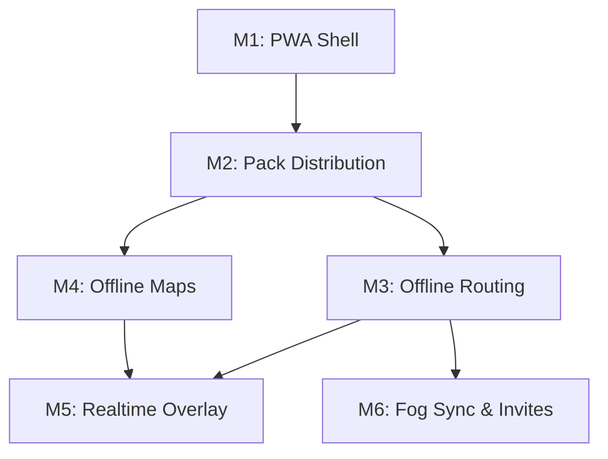

# Phased Implementation Plan: Dérivée Web

This plan breaks down the development of Dérivée Web into testable milestones, matching the vision outlined in the README. Each phase concludes with a concrete validation step on an iPhone.

## M1: PWA Shell
**Goal:** Build the installable offline-first shell (Preact/Vite) that caches its own assets but defers data pack loading.
**Concrete Build Steps:**
1. Setup Vite with `vite-plugin-pwa` for Workbox Service Worker generation.
2. Build UI shell (header, search bar placeholder, map container placeholder).
3. Self-host essential map assets: `fonts/Noto Sans Regular/0-255.pbf` and `sprites/dark.png`.
4. Configure `manifest.webmanifest` with `display: standalone` and `apple-touch-icon` (180x180).
5. Implement "Add to Home Screen" onboarding modal for iOS Safari.
**Test Procedure:**
- Serve via local network or Cloudflare Pages.
- Open in iOS Safari, add to Home Screen.
- Turn on Airplane Mode, force-close the app, and reopen it.
**Done Criteria:** The app opens instantly offline with a clean shell and no "Network Required" Safari errors.

## M2: Pack Distribution
**Goal:** Authenticate the user via Cloudflare Access Email OTP, serve PWA shell and API same-origin from the Cloudflare Worker, and stream, decompress, and unpack the 29.7 MB city pack directly into OPFS with T.1b integrity verification.
**Concrete Build Steps:**
1. Deploy Cloudflare Worker (`derivee-api`) serving both the PWA shell (via `[assets]` binding `env.ASSETS` from `dist`) and the API same-origin at `https://derivee-api.walsh-8de.workers.dev`, ensuring `CF_Authorization` (`SameSite=Lax`) is never withheld.
2. Direct R2 pack streaming: `GET /api/pack` streams `city-nyc.pack.zst` directly from the native `PACK` R2 binding with per-identity rate limiting (10 req/60s), eliminating presigned URLs, `aws4fetch`, and R2 bucket CORS complexity.
3. Authenticated session endpoint: `GET /api/me` returns `{ email }` for authenticated Access sessions, or 401 unauthenticated with top-level redirect to `/` for Email OTP login.
4. Dedicated Web Worker (`pack-installer.worker.ts`): streams download chunks, tracks live byte progress, decompresses 29.7 MB zstd payload to 65.3 MB using `@bokuweb/zstd-wasm`, extracts tar archive via `nanotar`, and writes files into OPFS (`/nyc/`) via `navigator.storage.getDirectory()`.
5. Hold Screen Wake Lock (`navigator.wakeLock.request('screen')`) during the entire install pipeline; release gracefully upon completion or error.
6. T.1b Swift install-time integrity validation (mirroring `CityPackManager.swift`): verify SQLite 3 magic (`SQLite format 3\0`), MasterHeader (232B, magic `0x31565244` "DRV1" / `0x4B4C4157` "WALK", version 1, endian `0x01020304`, physical file size match), and BinaryHeader (32B, magic `0x554C5452` "ULTR", version 1). On failure, delete partial files and surface retry.
7. Launch persistence: dual-verify `localStorage` metadata and physical presence of all 6 OPFS files on every launch.
**Test Procedure:**
- Open `https://derivee-api.walsh-8de.workers.dev` in iOS Safari.
- Login via Cloudflare Access Email OTP.
- Monitor foreground progress bar (download bytes vs Content-Length, decompression stage, files written n/6, verification).
- Confirm "Pack Installed" status, version 3, and file breakdown table.
- Turn on Airplane Mode, force-close Safari, and reopen: app launches offline and reports pack installed.
**Done Criteria:** All 6 pack files (`city_config.json`, `transit.sqlite`, `transit-lines.geojson`, `ultra_transfers.csr`, `timetable.bin`, `walk_graph.bin`) are verified in OPFS, and app state reflects "Pack Installed" both online and offline.

## M3: Offline Routing
**Goal:** Integrate the C++ RAPTOR and A* engine via WebAssembly to compute trips 100% offline.
**Concrete Build Steps:**
1. Compile `DeriveeCore` to WASM using `emcc` with flags: `-std=c++20 -O3 -flto -fno-rtti -fwasm-exceptions -sWASM=1 -sFILESYSTEM=0 -sINITIAL_MEMORY=134217728 -sALLOW_MEMORY_GROWTH=1 -sMAXIMUM_MEMORY=536870912 -sMALLOC="dlmalloc"`.
2. Implement C-ABI bridge with `_allocate_aligned` (using `posix_memalign(64)`).
3. Build `routing.worker.ts` to read binaries from OPFS via `FileSystemSyncAccessHandle` and pass pointers to the WASM heap.
4. Wire up origin/destination search UI to send `postMessage` queries to the worker.
**Test Procedure:**
- On iPhone (Airplane mode), select two locations (e.g., Union Square to Barclays Center).
- Execute the search.
**Done Criteria:** Query returns a valid transit itinerary (walk -> subway -> walk) in under 50ms.

## M4: Offline Maps
**Goal:** Render the NYC vector basemap offline using PMTiles and MapLibre.
**Concrete Build Steps:**
1. Generate `nyc-basemap.pmtiles` (~22 MB) using `pmtiles extract`.
2. Integrate `maplibre-gl` and the `pmtiles` JS library.
3. Register the custom protocol and load the PMTiles file from OPFS using `pmtiles.FileSource`.
4. Apply custom dark/fog styling (pruned to ~25 layers) and render transit routes (GeoJSON) from the M3 itinerary.
**Test Procedure:**
- On iPhone (Airplane mode), search a route.
- Pan and zoom the map along the route.
**Done Criteria:** MapLibre renders the vector tiles smoothly at 60fps with zero network requests, using local glyphs and sprites.

## M5: Realtime Overlay
**Goal:** Overlay live delays and vehicle positions when the device has connectivity.
**Concrete Build Steps:**
1. Implement network state listeners (`window.addEventListener('online'/'offline')`).
2. When online, directly fetch GTFS-RT protobufs from `api-endpoint.mta.info`.
3. Fetch daily reliability deltas (`transit_delta.sqlite.zst`) via `GET /api/delta` on the Worker.
4. Pass delay updates to the routing WASM worker to adjust timetables dynamically.
**Test Procedure:**
- On iPhone, disable Airplane Mode.
- Verify status badge switches from `[Sched]` to `[Live]`.
- Check itinerary for realtime delay adjustments.
**Done Criteria:** App gracefully transitions between scheduled and realtime data without blocking the UI.

## M6: Fog Sync & Invites
**Goal:** Synchronize explored territory across a trusted group of friends.
**Concrete Build Steps:**
1. Configure Cloudflare D1 with `user_fog` schema.
2. Add `POST /api/sync` and `GET /api/sync` to the Worker for atomic upserts.
3. Track visited H3 hexes in client IndexedDB.
4. Debounce and upload discovered hexes when online.
5. Add friends' emails to Cloudflare Access allowlist.
**Test Procedure:**
- Two iPhones logged in with different allowed emails.
- Explore an area on iPhone A, observe sync to Cloudflare D1.
- Open iPhone B, observe fog-of-war map update with iPhone A's exploration (if shared vision is enabled) or personal sync state.
**Done Criteria:** H3 hex state persists across sessions and devices via D1 synchronization.
