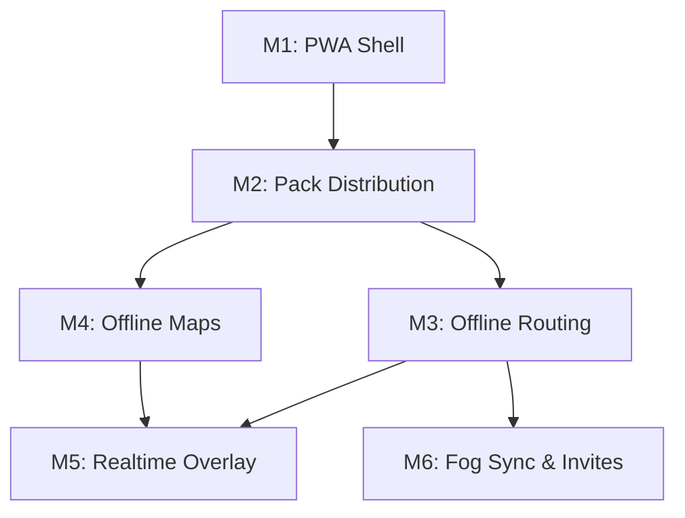

# Phased Implementation Plan: Dérivée Web

This plan breaks down the development of Dérivée Web into testable milestones, matching the vision outlined in the README. Each phase concludes with a concrete validation step on an iPhone.

## M1: PWA Shell
**Goal:** Build the installable offline-first shell (Preact/Vite) that caches its own assets but defers data pack loading.
**Concrete Build Steps:**
1. Setup Vite with `vite-plugin-pwa` for Workbox Service Worker generation.
2. Build UI shell (header, search bar placeholder, map container placeholder).
3. Self-host essential map assets: `fonts/Noto Sans Regular/0-255.pbf` and `sprites/dark.png`.
4. Configure `manifest.webmanifest` with `display: standalone` and `apple-touch-icon` (180x180).
5. Implement "Add to Home Screen" onboarding modal for iOS Safari.
**Test Procedure:**
- Serve via local network or Cloudflare Pages.
- Open in iOS Safari, add to Home Screen.
- Turn on Airplane Mode, force-close the app, and reopen it.
**Done Criteria:** The app opens instantly offline with a clean shell and no "Network Required" Safari errors.

## M2: Pack Distribution
**Goal:** Authenticate the user via Cloudflare Access Email OTP, serve PWA shell and API same-origin from the Cloudflare Worker, and stream, decompress, and unpack the 29.7 MB city pack directly into OPFS with T.1b integrity verification.
**Concrete Build Steps:**
1. Deploy Cloudflare Worker (`derivee-api`) serving both the PWA shell (via `[assets]` binding `env.ASSETS` from `dist`) and the API same-origin at `https://derivee-api.walsh-8de.workers.dev`, ensuring `CF_Authorization` (`SameSite=Lax`) is never withheld.
2. Direct R2 pack streaming: `GET /api/pack` streams `city-nyc.pack.zst` directly from the native `PACK` R2 binding with per-identity rate limiting (10 req/60s), eliminating presigned URLs, `aws4fetch`, and R2 bucket CORS complexity.
3. Authenticated session endpoint: `GET /api/me` returns `{ email }` for authenticated Access sessions, or 401 unauthenticated with top-level redirect to `/` for Email OTP login.
4. Dedicated Web Worker (`pack-installer.worker.ts`): streams download chunks, tracks live byte progress, decompresses 29.7 MB zstd payload to 65.3 MB using `@bokuweb/zstd-wasm`, extracts tar archive via `nanotar`, and writes files into OPFS (`/nyc/`) via `navigator.storage.getDirectory()`.
5. Hold Screen Wake Lock (`navigator.wakeLock.request('screen')`) during the entire install pipeline; release gracefully upon completion or error.
6. T.1b Swift install-time integrity validation (mirroring `CityPackManager.swift`): verify SQLite 3 magic (`SQLite format 3\0`), MasterHeader (232B, magic `0x31565244` "DRV1" / `0x4B4C4157` "WALK", version 1, endian `0x01020304`, physical file size match), and BinaryHeader (32B, magic `0x554C5452` "ULTR", version 1). On failure, delete partial files and surface retry.
7. Launch persistence: dual-verify `localStorage` metadata and physical presence of all 6 OPFS files on every launch.
**Test Procedure:**
- Open `https://derivee-api.walsh-8de.workers.dev` in iOS Safari.
- Login via Cloudflare Access Email OTP.
- Monitor foreground progress bar (download bytes vs Content-Length, decompression stage, files written n/6, verification).
- Confirm "Pack Installed" status, version 3, and file breakdown table.
- Turn on Airplane Mode, force-close Safari, and reopen: app launches offline and reports pack installed.
**Done Criteria:** All 6 pack files (`city_config.json`, `transit.sqlite`, `transit-lines.geojson`, `ultra_transfers.csr`, `timetable.bin`, `walk_graph.bin`) are verified in OPFS, and app state reflects "Pack Installed" both online and offline.

## M3: Offline Routing
**Goal:** Integrate the C++ RAPTOR and A* engine via WebAssembly to compute trips 100% offline.
**Concrete Build Steps:**
1. **[M3a - DONE]** Compile `DeriveeCore` to WASM using `emcc` with flags: `-std=c++20 -O3 -flto -fno-rtti -fwasm-exceptions -sWASM=1 -sFILESYSTEM=0 -sINITIAL_MEMORY=134217728 -sALLOW_MEMORY_GROWTH=1 -sMAXIMUM_MEMORY=536870912 -sMALLOC="dlmalloc"`.
2. **[M3a - DONE]** Implement C-ABI bridge with `_allocate_aligned` (using `posix_memalign(64)`).
3. **[M3a - DONE]** Node verification harness proving the engine loads real binaries and computes valid trips without crashes.
4. **[M3b - DONE]** Build `routing.worker.ts` to read binaries from OPFS via `FileSystemSyncAccessHandle` and pass pointers directly into WASM heap views.
5. **[M3b - DONE]** Wire up offline origin/destination search UI (autocomplete over `stops.json`) to send `postMessage` queries to the worker and render computed `JourneySegment` legs.
6. **[M3b Hotfix - DONE]** Fixed engine init hang and native transfer divergence:
   - Replaced fragile `new Function` eval with `importScripts('/wasm/derivee_core.js')` in classic worker via `DeriveeCoreModule` factory.
   - Fixed `instantiateWasm` error propagation so `WebAssembly.instantiate` failures reject immediately rather than hanging indefinitely.
   - Added 30-second init timeout posting `{ type: 'ERROR', message: 'engine init timed out' }`.
   - Aligned `is_transfer` exactly with native `JourneySegment::is_transfer_leg()` (`trip_id == 0xFFFFFFFF || route_id == 0xFFFF`), eliminating `=== 0` clauses.
   - Extracted orchestration into `routingEngine.ts` with comprehensive unit & regression test suite (`npm test`).
7. **[M3b Display Cleanup - DONE]** Cleaned up itinerary leg presentation in `TripPlanner.tsx` and extracted display logic into `itineraryDisplay.ts`:
   - Stripped internal engine trip IDs (`Trip ID: #...`) from all UI display models and JSX output.
   - Collapsed zero-length origin and destination stub legs into compact "Start at {station}" and "Arrive at {station}" rows while preserving full transit leg details.
   - Comprehensive test suite in `itineraryDisplay.test.ts`.
8. **[M3b Itinerary Panel Fix - DONE]** Resolved production itinerary panel rendering bugs (collapse + scroll):
   - Aligned zero-length stub leg collapse predicate in `itineraryDisplay.ts` against real C++ RAPTOR worker output: matches legs where departure and arrival resolve to the same station name (e.g. Times Sq-42 St complex platform transfer) and duration < 60s, collapsing Leg 1 to compact "Start at {station}" and Leg 3 to "Arrive at {station}".
   - Made itinerary panel scrollable and phone-viewport safe: bounded `.itinerary-results-container` with `max-height: 340px`, `overflow-y: auto`, and `-webkit-overflow-scrolling: touch`, ensuring all legs are reachable without trapping page scroll when content fits.
   - Full test suite green (25 tests passing) with real worker output fixture regression and scroll container assertions.

**Test Procedure (Phone Verification):**
- Install pack in PWA.
- Enable Airplane Mode on phone.
- In trip planner, search "Times Sq" as origin and "Atlantic Av" as destination.
- Tap "Route".
- Verify itinerary appears with full legs (walk/transfer vs transit, departure and arrival times, route IDs) with zero network calls and no console errors.
**Done Criteria:** Full offline transit routing flow is testable on-device; query returns a valid itinerary in <50ms completely offline.

## M4: Offline Maps
**Goal:** Render the NYC vector basemap offline using PMTiles and MapLibre, followed by transit layers and fog overlay.

### M4a: Offline NYC basemap (MapLibre + PMTiles) — DONE
1. **PMTiles NYC extract (24.9 MB, budget ≤ ~30 MB):**
   - Acquired and clustered OSM NYC extract covering all 5 boroughs plus margin (z0–z14). Pruned heavy building footprints and POIs to produce an optimized 24,991,495 byte archive.
   - Uploaded to Cloudflare R2 bucket `fog-of-transit` as `basemap-nyc.pmtiles`.
   - Added Cloudflare Worker endpoint `GET /api/basemap?city=nyc` with HTTP 206 Partial Content / Range header streaming and identity rate limiting.
   - Dedicated Web Worker (`basemap-installer.worker.ts`) downloads and streams the extract into OPFS at `cities/nyc/basemap.pmtiles` using `FileSystemSyncAccessHandle` / `createWritable`.
   - Screen Wake Lock (`navigator.wakeLock`) held during download to prevent mobile sleep.
2. **PMTiles v3 Integrity Verification (`pmtilesIntegrity.ts`):**
   - Validates 127-byte binary header: 7-byte ASCII magic `"PMTiles"`, spec version `3`, physical size ≤ 35 MB budget ceiling, tile data section within physical bounds, positive tile entry count, MVT tile type (1), and valid zoom hierarchy.
   - On error or corruption, partial files are immediately purged from OPFS and a clean user error state is triggered.
3. **MapLibre GL JS Offline Rendering (`maplibreAdapter.ts`):**
   - Custom `pmtiles://` protocol registered with MapLibre GL JS v6.
   - OPFS `File` handle wrapped in `pmtiles.FileSource` — zero network after install.
   - Unlimited camera viewport: no camera clamps or `maxBounds`.
   - Precached local vector cartography: `map-style-dark.json`, local Noto Sans glyph ranges (`fonts/Noto Sans {Regular,Bold}/0-255.pbf`), and local dark sprites.
4. **Layout & Overlay:**
   - Full-screen base map (`#map-container`) in `BasemapView.tsx`.
   - Header, search, and TripPlanner overlay unchanged with touch/pointer passthrough.
5. **Rule 11 States & Transitions:**
   - Enforces `map-loading` (progress %), `map-ready` (canvas active), `map-error` (retry button), and `map-cached` (instant load on revisit with zero flash).
6. **Rule 12 UI Copy:** Zero internal identifiers in progress, error, and status copy.
7. **Rule 13–14 Tests:** Full test suite green with `node:test` covering integrity, download state machine, tile protocol offline serving, and UI copy.

### M4b: Transit Cartography & Fog Toggle — UPCOMING
- GeoJSON transit lines and station overlays.
- Fog of war reveal canvas overlay.
- Transit vs Fog mode toggle.

## M5: Realtime Overlay
**Goal:** Overlay live delays and vehicle positions when the device has connectivity.
**Concrete Build Steps:**
1. Implement network state listeners (`window.addEventListener('online'/'offline')`).
2. When online, directly fetch GTFS-RT protobufs from `api-endpoint.mta.info`.
3. Fetch daily reliability deltas (`transit_delta.sqlite.zst`) via `GET /api/delta` on the Worker.
4. Pass delay updates to the routing WASM worker to adjust timetables dynamically.
**Test Procedure:**
- On iPhone, disable Airplane Mode.
- Verify status badge switches from `[Sched]` to `[Live]`.
- Check itinerary for realtime delay adjustments.
**Done Criteria:** App gracefully transitions between scheduled and realtime data without blocking the UI.

## M6: Fog Sync & Invites
**Goal:** Synchronize explored territory across a trusted group of friends.
**Concrete Build Steps:**
1. Configure Cloudflare D1 with `user_fog` schema.
2. Add `POST /api/sync` and `GET /api/sync` to the Worker for atomic upserts.
3. Track visited H3 hexes in client IndexedDB.
4. Debounce and upload discovered hexes when online.
5. Add friends' emails to Cloudflare Access allowlist.
**Test Procedure:**
- Two iPhones logged in with different allowed emails.
- Explore an area on iPhone A, observe sync to Cloudflare D1.
- Open iPhone B, observe fog-of-war map update with iPhone A's exploration (if shared vision is enabled) or personal sync state.
**Done Criteria:** H3 hex state persists across sessions and devices via D1 synchronization.
