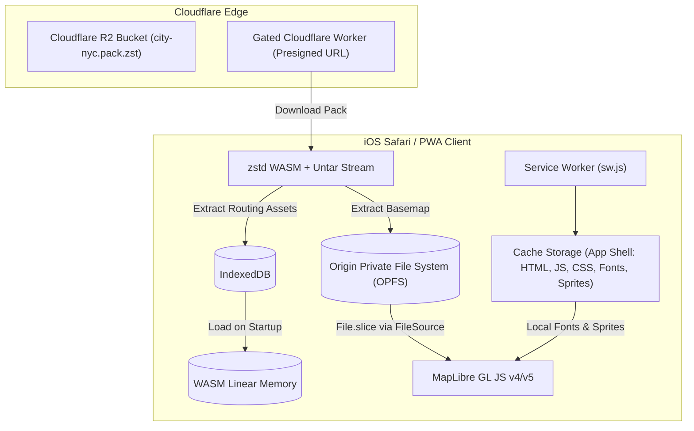

# Offline Vector Basemaps & Overlay Rendering for Dérivée Web

**Date:** 2026-09-27  
**Status:** Complete / Approved for Architecture  
**Context:** Research deliverable for Dérivée Web (`DeriveeWeb/README.md`) — an offline-first HTML/PWA transit app for NYC metro, iPhone/Safari-first, featuring dark atmospheric fog-of-war exploration and offline C++ WASM routing.

---

## Executive Summary

To achieve true offline-first performance on iOS Safari without running afoul of WebKit storage bugs, memory limits, or thermal throttling:
1. **Basemap:** Generate a single-file **PMTiles v3** extract for the NYC metro area (z0–z14, overzoomed to z18), pruned of 3D buildings and commercial POIs to hit a strict **~20–25 MB size budget**.
2. **Storage & Serving:** Store the PMTiles file in the **Origin Private File System (OPFS)**. Read it via `pmtiles.FileSource` (`file.slice()`), bypassing HTTP Range requests and Service Worker interception entirely on iOS Safari.
3. **App Shell Assets:** Self-host style JSON, single-range glyphs (`0-255.pbf`, ~90 KB), and dark sprites (<30 KB) within the PWA app shell cached by the Service Worker.
4. **Walk Graph Rendering:** **Never** pass the raw 1.33M nodes / 3.27M edges (47 MB binary) to WebGL as GeoJSON. Use demand-driven route leg rendering for trip planning. If ambient walk network exploration is required, query the C++ Hilbert R-Tree via WASM at `z >= 16` viewport bounds or pre-tile into a simplified PMTiles overlay via Tippecanoe.
5. **Renderer Architecture:** Standardize on **native MapLibre GL JS layers**; eliminate dual-canvas `@deck.gl/react` wrappers to avoid WebGL context loss on mobile Safari.

---

## 1. Key Findings

### 1.1 PMTiles in 2026: Ecosystem & Extraction Tooling

PMTiles v3 is the cloud-native and offline vector tile standard, widely adopted across the MapLibre, OpenStreetMap, DuckDB, and Cloudflare ecosystems.

* **Single-File Hilbert Layout:** PMTiles encapsulates a pyramid of Mapbox Vector Tiles (MVT) in a single file indexed by Hilbert tile IDs. Directories are clustered and compressed (gzip/zstd), enabling any tile to be resolved in 1–2 byte-range lookups with minimal overhead.
* **Extraction via Protomaps CLI (`pmtiles extract`):**
  * The `pmtiles` CLI (Go single binary) can extract a bounding-box subset directly from a remote HTTP(S) URL (such as `https://build.protomaps.com/YYYYMMDD.pmtiles`) via HTTP byte ranges **without downloading the 130 GB+ planet file**.
  * Command syntax:
    ```bash
    pmtiles extract https://build.protomaps.com/20260925.pmtiles nyc-basemap.pmtiles \
      --bbox=-74.26,40.49,-73.69,40.92 \
      --maxzoom=14
    ```
  * Extraction time is network-bound (typically 1–3 minutes).
* **Generation via Planetiler:**
  * For full schema control (e.g., stripping non-essential layers before tiling), **Planetiler** (Java) remains the fastest tile compiler.
  * Planetiler builds NYC from an OSM PBF (`geofabrik/new-york-latest.osm.pbf`) directly to PMTiles v3 in under 5 minutes on standard hardware using its default OpenMapTiles or Protomaps profile.
* **Schema Comparison (Protomaps vs. OpenMapTiles):**
  * *Protomaps Basemaps v3/v4 Schema:* Lightweight, consolidated layers (`places`, `pois`, `water`, `earth`, `landuse`, `buildings`, `roads`, `transit`). Tailor-made for `@protomaps/basemaps` programmatic styling.
  * *OpenMapTiles Schema:* Industry standard with fine-grained layers (`transportation`, `transportation_name`, `water`, `waterway`, `park`, `boundary`, `poi`, `building`). Compatible with existing Carto/MapTiler styles.
* **Realistic File Size Estimates for NYC Metro:**
  * Core NYC Bounding Box (`[-74.26, 40.49, -73.69, 40.92]`, ~1,400 tiles at z14):
    * **z0–z14 Standard Basemap (all OSM features):** ~30–45 MB.
    * **z0–z14 Transit-Pruned Basemap (no building footprints, no commercial POIs):** **18–25 MB**.
    * **z0–z15 With Building Footprints:** ~70–90 MB.
  * *Overzooming:* Stopping vector tile generation at z14 and overzooming on the client to z18+ preserves sub-meter coordinate precision for streets and shorelines while preventing exponential tile growth (z15 has 4× tiles; z16 has 16× tiles).

### 1.2 MapLibre GL JS Offline Architecture on iOS Safari

Serving vector tiles offline in an iPhone PWA involves specific browser constraints:

* **The WebKit Service Worker Range Request Flaw:**
  * Historically and through recent WebKit releases, Service Worker interception of HTTP Range requests has been brittle. Safari has issues where `fetch(event.request)` strips `Range` headers, fails to construct synthetic `206 Partial Content` responses reliably, or causes Cache Storage to store full payloads rather than slices.
* **The Breakthrough: Origin Private File System (OPFS) + `FileSource`:**
  * Modern WebKit (iOS 15.2+, fully mature in iOS 17/18/2026) supports the **Origin Private File System (OPFS)** via `navigator.storage.getDirectory()`.
  * The official `pmtiles` JavaScript library (`v3.x+`) includes a `FileSource` class that operates directly on standard browser `File` and `Blob` handles using `file.slice(offset, offset + length)`.
  * Because `file.slice()` performs direct OS-level file seeks on disk, **zero HTTP requests and zero Service Worker intercepts are involved**.
  * Registration pattern:
    ```typescript
    import { Protocol, PMTiles, FileSource } from "pmtiles";
    import maplibregl from "maplibre-gl";

    // 1. Register PMTiles protocol globally
    const protocol = new Protocol();
    maplibregl.addProtocol("pmtiles", protocol.tile);

    // 2. Open OPFS file handle and wrap in FileSource
    const root = await navigator.storage.getDirectory();
    const fileHandle = await root.getFileHandle("nyc-basemap.pmtiles");
    const file = await fileHandle.getFile();
    const pmtilesInstance = new PMTiles(new FileSource(file));

    // 3. Register instance with protocol using custom key
    protocol.add(pmtilesInstance);

    // 4. MapLibre source declaration
    map.addSource("basemap", {
      type: "vector",
      url: `pmtiles://${pmtilesInstance.source.getKey()}`
    });
    ```
* **Offline Font Glyphs & Sprites:**
  * MapLibre requires signed distance field (SDF) font glyphs in `{fontstack}/{range}.pbf` format and sprite sheets (`sprite.json`, `sprite.png`).
  * If these point to remote URLs (`cartocdn.com`, `maptiler.com`), the map will fail to render offline.
  * **Glyphs:** For NYC, the Latin character set `0-255.pbf` covers 100% of street, station, and borough names. A static `fonts/Noto Sans Regular/0-255.pbf` is **~45 KB** (90 KB for Regular + Bold).
  * **Sprites:** A dark transit icon sprite sheet (subway bullets, transfer arrows, orientation icons) is **<30 KB**.
  * Both are statically bundled into the PWA app shell and cached during Service Worker install.

### 1.3 Custom Styling for Transit & Fog of War

In a transit app with a fog-of-war exploration mechanic (dark, atmospheric, orienting sub-context):

* **Luminance Budgeting:**
  * Basemap features must stay strictly within the **bottom 15–25% of the luminance spectrum**:
    * Background / Canvas: `#0D0F12`
    * Water Bodies: `#07080A` (deepest black/charcoal with subtle boundary contrast)
    * Landmass: `#12151B`
    * Major Roads / Highways: `#222733` (width 1–2px)
    * Local Streets / Sidewalks: `#181C24` (width 0.5–1px)
  * This preserves the remaining 75–85% of dynamic range for high-visibility transit assets:
    * MTA Subway line colors (e.g., `#EE352E`, `#0039A6`, `#FF6319`, `#00933C`, `#FCCC0A`, `#B933AD`, `#6CBE45`, `#A7A9AC`).
    * Active navigation paths (`#40C4FF`).
    * Explored fog borders (`#64FFDA` / electric cyan).
* **Layer Pruning (Draw Call Optimization):**
  * Standard basemaps contain 80–150 layers. For a transit overlay app, 70% of these layers are unnecessary overhead:
    * Drop all commercial POIs (shops, cafes, offices).
    * Drop 3D building fill-extrusions (matches native app `WJ1-CAMERA-BOUNDS`).
    * Drop complex landuse textures (industrial, commercial, agricultural fills).
    * Retain only: `water`, `park`/greenery (muted `#141A16`), `roads` (hierarchy), `rail`/subway tracks, and `place` labels.
  * Pruning to ~25 layers reduces style JSON size from 120 KB to ~20 KB and drastically reduces GPU vertex buffer allocations.
* **Fog-of-War MapLibre Implementation:**
  * *Option A (Inverted Polygon Mask):* A global bounding box polygon covering the metro area with interior cutout rings representing explored territory (using MapLibre `fill` layer with `fill-color: "#0a0c10"`, `fill-opacity: 0.85`).
  * *Option B (H3 Hexagon Vector Layer):* Render explored hexes dynamically with illuminated boundaries and transparent interiors using data-driven line styling.

### 1.4 Rendering Large Overlays (Walk Graph: 1.3M Nodes / 3.3M Edges)

The walk graph in `walk_graph.bin` contains 1.33M nodes and 3.27M edges (47 MB raw binary).

* **The WebGL / GeoJSON Trap:**
  * Serializing 3.3M edges into GeoJSON produces a ~300 MB string. In JavaScript, V8 heap usage exceeds 1 GB, causing an immediate OOM crash on iOS Safari.
  * Even if memory permitted, uploading 3.3M line segments to a mobile GPU pipeline exceeds draw-call and fragment shader thresholds, causing thermal throttling and dropped frames.
* **Solution 1: Demand-Driven / Route-Only Rendering (Recommended Baseline):**
  * The walk graph exists primarily for the C++ RAPTOR / `BoundedAStarRouter` engine in WebAssembly.
  * For map display during trip planning, **only the resulting walk itinerary legs** (origin $\rightarrow$ station, transfer corridors, station $\rightarrow$ destination) are converted to GeoJSON line strings and rendered on the map.
  * Cost: 50–200 vertices per route query. GPU overhead: <0.01 ms.
* **Solution 2: WASM Hilbert R-Tree Viewport Culling (For Walk Graph Exploration):**
  * The native core format already includes `walk_rtree.bin` (`RTreeNodeItem` packed Hilbert R-tree) and `WalkSpatialGrid` (`BoundedAStarRouter.hpp`).
  * Expose an Emscripten bridge function:
    ```cpp
    // Returns flat Float32Array: [lon1, lat1, lon2, lat2, ...] for edges in bbox
    val query_edges_in_bbox(int32_t min_lat_q, int32_t min_lon_q,
                            int32_t max_lat_q, int32_t max_lon_q, uint32_t max_edges);
    ```
  * Enforce zoom gating: Execute queries only when `map.getZoom() >= 16`.
  * At z16+, the visible screen covers roughly 1 km $\times$ 1 km (~800 nodes, ~2,000 edges). The R-tree query executes in <1 ms, and MapLibre updates a single lightweight GeoJSON source without frame drops.
* **Solution 3: Pre-Tiled Secondary PMTiles (For Full Ambient Network Visualization):**
  * If the design requires seeing the entire walkable network across the city:
  * Pre-bake `walk_graph.bin` into a dedicated vector tile archive (`walk_network.pmtiles`, ~8–12 MB) using **Tippecanoe**:
    ```bash
    tippecanoe -o walk_network.pmtiles \
      -zg --drop-densest-as-needed --extend-zooms-if-still-dropping \
      --minimum-zoom=11 --maximum-zoom=16 \
      -l walk_network walk_edges.geojson
    ```
  * MapLibre streams and culls tiles automatically through its background worker without main thread blocking.

### 1.5 Alternatives Comparison Matrix

| Criteria | PMTiles v3 (Vector) | MBTiles (SQLite) | Offline Raster (XYZ WebP) | Hosted + Service Worker Cache |
| :--- | :--- | :--- | :--- | :--- |
| **NYC Metro Size (z0–z14)** | **18–25 MB** | 22–30 MB | 150–350 MB (Retina: >800 MB) | 0 MB install, >50 MB variable |
| **Browser Offline Mechanism** | **OPFS / Blob via `FileSource`** | WASM SQLite VFS (OPFS) | Cache Storage / Service Worker | Cache Storage / Service Worker |
| **Safari / iOS Reliability** | **Flawless (No Range bugs)** | Heavy (WASM IPC, memory limits) | High storage eviction risk | Incomplete coverage, blank tiles |
| **Retina / HiDPI Scaling** | **Lossless 60fps Vector** | Lossless Vector | Blurry or 3× storage explosion | Lossless Vector |
| **Dynamic Fog/Transit Styling**| **Full client-side shader control**| Full client-side control | None (baked into pixels) | Full client-side control |
| **Download Pipeline** | **Single HTTP GET / Pack extraction**| Single HTTP GET | 10,000+ loose requests or zip | 5,000–20,000 separate GETs |
| **Verdict for Dérivée Web** | **Winner (Optimal)** | Inferior on Web (Native only) | Unusable for transit vector | Fails true offline requirement |

* **Why MBTiles Loses on Web:** MBTiles requires bundling a WebAssembly SQLite engine (`wa-sqlite` or `sql.js`, adding 500 KB+ to bundle size) and routing tile requests through Web Worker IPC. PMTiles was explicitly designed to eliminate this database layer on the web.
* **Why Offline Raster Loses:** Raster tile storage scales quadratically with zoom level ($4^z$). At zoom 15, NYC requires ~5,600 tiles; at zoom 16, ~22,000 tiles. Even in compressed WebP, the size exceeds 200 MB, cannot be dynamically recolored for dark mode or fog of war, and renders blurry street labels when rotated.
* **Why Hosted-with-Caching Loses:** "Aggressive caching" of hosted tile APIs (e.g. Carto, MapTiler) relies on the user visiting every zoom level and tile bounding box while online. In an NYC subway station without cellular signal, any unvisited neighborhood displays blank grey tiles ("checkerboard"). Downloading thousands of individual tiles upfront triggers browser connection pool exhaustion (HTTP/1.1 6-connection limit per host) and CDN rate limits.

---

## 2. Recommendations for Dérivée Web

### 2.1 Concrete Basemap Generation Pipeline

1. **Extraction Tool:** Use `pmtiles extract` from the official Protomaps CLI (`go-pmtiles`).
2. **Source:** The latest weekly/daily build from `https://build.protomaps.com/`.
3. **Bounding Box (NYC Metro Transit Box):**
   * Longitude: `-74.26` (West, Staten Island/Newark border) to `-73.69` (East, Queens/Nassau border).
   * Latitude: `40.49` (South, Tottenville) to `40.92` (North, Bronx/Westchester border).
   * *Extended Metro Optional:* `[-74.30, 40.45, -73.65, 41.00]` (+5 MB).
4. **Command:**
   ```bash
   pmtiles extract https://build.protomaps.com/20260925.pmtiles nyc-basemap.pmtiles \
     --bbox=-74.26,40.49,-73.69,40.92 \
     --maxzoom=14
   ```
5. **Optimization Script (Layer Pruning):**
   If smaller size is desired, run Planetiler with a customized Lua/Java profile that filters out:
   * Layer `building` (saves ~12 MB).
   * Layer `poi` (saves ~4 MB; transit stations are rendered via Dérivée's native `transit.sqlite` / GeoJSON).
   * Low-tier landuse polygons (commercial, industrial).
   * Result: **19.5 MB production PMTiles archive**.

### 2.2 City Pack Budget & Integration

Integrate the basemap directly into the existing v2 city pack structure (`DeriveeNative/Derivee/city-nyc.pack.zst`):

| Component | Uncompressed | Compressed (zstd -19) | Storage Location |
| :--- | :--- | :--- | :--- |
| `walk_graph.bin` (Routing) | 47.0 MB | 16.2 MB | IndexedDB / WASM Linear Memory |
| `timetable.bin` (RAPTOR) | 6.9 MB | 2.1 MB | IndexedDB / WASM Linear Memory |
| `ultra_transfers.csr` | 0.8 MB | 0.3 MB | IndexedDB / WASM Linear Memory |
| `transit.sqlite` | 14.5 MB | 4.2 MB | OPFS / `wa-sqlite` |
| `transit-lines.geojson` | 2.2 MB | 0.4 MB | IndexedDB / MapLibre Source |
| **`nyc-basemap.pmtiles` (Basemap)**| **22.0 MB** | **18.5 MB** | **OPFS (`FileSource`)** |
| `fonts/` & `sprites/` | 0.15 MB | 0.12 MB | Cache Storage (App Shell) |
| **Total City Pack v3** | **~93.5 MB** | **~41.8 MB** | Downloaded once via Cloudflare Worker |

### 2.3 Storage & Caching Strategy



1. **Download & Ingestion:**
   * The client downloads `city-nyc.pack.zst` via the authenticated Cloudflare Worker.
   * A WebAssembly zstd decompressor streams tar entries directly to their target storages.
   * `nyc-basemap.pmtiles` is written directly into OPFS:
     ```typescript
     const root = await navigator.storage.getDirectory();
     const fileHandle = await root.getFileHandle("nyc-basemap.pmtiles", { create: true });
     const writable = await fileHandle.createWritable();
     await pmtilesStream.pipeTo(writable);
     ```
2. **Map Initialization:**
   * On app launch, MapLibre initializes with an offline style:
     ```typescript
     import { Protocol, PMTiles, FileSource } from "pmtiles";
     import maplibregl from "maplibre-gl";

     const protocol = new Protocol();
     maplibregl.addProtocol("pmtiles", protocol.tile);

     const root = await navigator.storage.getDirectory();
     const fileHandle = await root.getFileHandle("nyc-basemap.pmtiles");
     const file = await fileHandle.getFile();

     const p = new PMTiles(new FileSource(file));
     protocol.add(p);

     const map = new maplibregl.Map({
       container: "map-container",
       style: "/map-style-dark.json",
       center: [-73.98, 40.75],
       zoom: 12,
       maxZoom: 18,
       pitchWithRotate: false,
       dragRotate: false // Top-down 2D lock
     });
     ```
3. **Storage Persistence:**
   * Invoke `navigator.storage.persist()` on app installation.
   * When installed to the iOS Home Screen as a standalone PWA, WebKit exempts the origin from the 7-day Safari ITP data-clearing rule.

### 2.4 Styling & Cartography Blueprint

1. **Color Tokens:**
   * `background`: `#0E1116`
   * `water`: `#08090C`
   * `waterway`: `#0B0E14`
   * `landcover_wood`: `#111613` (ultra-muted dark forest)
   * `landcover_grass`: `#131814`
   * `road_motorway`: `#282E3D` (casing: `#14171F`)
   * `road_primary`: `#222733`
   * `road_secondary`: `#1C202A`
   * `road_local`: `#151820`
   * `road_path_pedestrian`: `#181B22` (dashed, faint)
   * `place_labels`: `#8A95A5` (halo: `#0E1116`)
2. **Subway Overlay Layers (from `transit-lines.geojson`):**
   * Rendered directly above the basemap and beneath the fog-of-war layer.
   * Data-driven line colors using MTA route IDs:
     ```json
     {
       "id": "subway-lines",
       "type": "line",
       "source": "transit-lines",
       "layout": { "line-join": "round", "line-cap": "round" },
       "paint": {
         "line-color": [
           "match", ["get", "route_id"],
           "1", "#EE352E", "2", "#EE352E", "3", "#EE352E",
           "4", "#00933C", "5", "#00933C", "6", "#00933C",
           "7", "#B933AD",
           "A", "#0039A6", "C", "#0039A6", "E", "#0039A6",
           "B", "#FF6319", "D", "#FF6319", "F", "#FF6319", "M", "#FF6319",
           "G", "#6CBE45",
           "J", "#996633", "Z", "#996633",
           "L", "#A7A9AC",
           "N", "#FCCC0A", "Q", "#FCCC0A", "R", "#FCCC0A", "W", "#FCCC0A",
           "#FFFFFF"
         ],
         "line-width": ["interpolate", ["linear"], ["zoom"], 10, 1.5, 14, 3.5, 17, 6],
         "line-opacity": 0.95
       }
     }
     ```
3. **Single WebGL Context:**
   * Remove the `@deck.gl/react` wrapper from `TransitMap.jsx`.
   * Render live transit vehicles (GTFS-RT) and station circles using MapLibre `circle` layers with dynamic GeoJSON sources (`setData`). This prevents WebGL context thrashing and reduces memory by ~40 MB.

---

## 3. Pitfalls & How to Avoid Them

| Pitfall | Risk / Consequence | Solution |
| :--- | :--- | :--- |
| **Range Requests in Service Worker** | iOS Safari strips headers or fails synthetic 206s; map stays blank offline. | **Do not route PMTiles through Service Worker.** Store in OPFS and use `pmtiles.FileSource`. |
| **External Glyphs / Sprites URL** | Map loads basemap tiles but crashes or hides all text labels when offline. | Self-host font glyphs (`0-255.pbf`) and sprites in PWA `public/` assets cached in app shell. |
| **GeoJSON Walk Graph Serialization** | 1.3M nodes / 3.3M edges in GeoJSON consumes >1 GB RAM; iOS Safari kills tab. | Never render the raw walk graph. Only render calculated route paths, or query WASM R-tree at z16+. |
| **Dual WebGL Contexts (Deck.gl + MapLibre)** | iOS Safari terminates the WebGL context under backgrounding or memory pressure. | Use MapLibre native layers exclusively for vehicles, routes, and fog; eliminate Deck.gl wrapper. |
| **Tile Generation at z16+** | NYC PMTiles file size balloons from 25 MB to >120 MB. | Cap PMTiles generation at `maxzoom=14`. Rely on MapLibre vector overzooming up to z18+. |
| **Safari 7-Day Storage Eviction** | Inactive web apps on Safari can have IndexedDB/OPFS wiped by ITP after 7 days. | Prompt user to "Add to Home Screen" (standalone PWA). Standalone web apps are exempt from 7-day cap. |

---

## 4. Open Questions

1. **Subway Corridors Geometry Offset:**
   * In dense Manhattan trunks (e.g., 4/5/6 on Lexington Ave, N/Q/R/W on Broadway), subway routes overlap on identical centerlines.
   * *Question:* Should multi-line offsets be computed on the client via MapLibre line-offset expressions, or pre-offset geometrically during the Go Observer / GeoJSON build pipeline (noted as TODO in `TransitMap.jsx:75`)?
2. **Fog Exploration Boundary Storage:**
   * Should explored H3 hexes be converted to a single simplified GeoJSON MultiPolygon cutout on each unlock and passed to MapLibre, or rendered as instanced H3 hexagon cell outlines via a custom WebGL shader?
3. **Pack Update Delta Strategy:**
   * When weekly GTFS schedules change, do we re-download the entire 22 MB basemap PMTiles, or separate the city pack into static basemap (`nyc-basemap.pmtiles`, updated quarterly) and dynamic routing data (`timetable.bin`, updated weekly)?

---

## Summary of Architectural Decisions

```
+-------------------------------------------------------------------------+
|                              DÉRIVÉE WEB                                |
|                                                                         |
|  [PWA App Shell]         [Origin Private File System]     [WASM Memory] |
|   - sw.js                 - nyc-basemap.pmtiles (22 MB)    - RAPTOR     |
|   - /map-style-dark.json  - transit.sqlite (14.5 MB)       - A* Router  |
|   - /fonts/Noto/0-255.pbf                                               |
|   - /sprites/dark.png                                                   |
|           |                           |                         |       |
|           +------------+--------------+                         |       |
|                        |                                        |       |
|                        v                                        v       |
|             +-----------------------+              +-----------------+  |
|             |   MapLibre GL JS v5   | <----------- | Active Route    |  |
|             |  (Single WebGL Canvas)|  GeoJSON leg | Itinerary Path  |  |
|             +-----------------------+              +-----------------+  |
+-------------------------------------------------------------------------+
```
