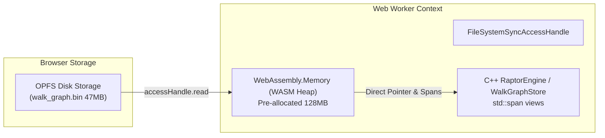
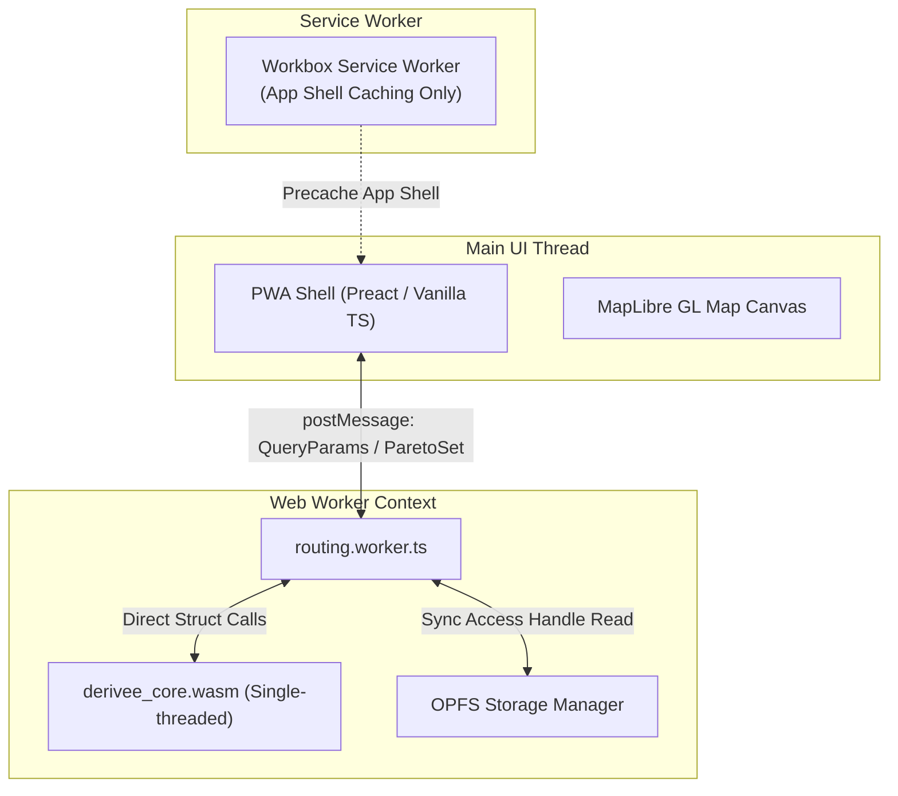

# Research: WebAssembly Routing Engine, Memory Architecture & Binary Asset Hydration (2026)

**Project:** Dérivée Web  
**Date:** 2026-09-27  
**Status:** Complete  
**Target Platform:** Mobile Safari (iOS 17/18/26+), Chromium / Firefox PWA  
**Key Constraints:** Pure offline transit & pedestrian routing, 55 MB uncompressed custom binary assets (`walk_graph.bin` 47 MB, `timetable.bin` 6.9 MB, `ultra_transfers.csr` 0.6 MB), C++20 routing engine (`RaptorEngine`, `BoundedAStarRouter`), 28 MB compressed pack archive (`city-nyc.pack.zst`), iPhone WebKit memory/Jetsam constraints.

---

## 1. Executive Summary

Dérivée Web requires taking our production C++20 RAPTOR transit engine and bounded pedestrian A* router, compiling them to WebAssembly, and running millisecond-latency multimodal trip queries 100% offline in a mobile browser.

Our existing C++ engine architecture (`BinaryPayloadView`, `WalkGraphStore`, `ULTRADataStore`) is **uniquely well-suited for WebAssembly**: it already takes raw in-memory pointers (`const uint8_t* buffer_ptr, size_t length_bytes`) and wraps them in `std::span` views without performing any POSIX file I/O, dynamic allocations of graph topology, or string deserialization.

However, executing this in a browser—specifically on **iOS Safari**—imposes five decisive technical constraints:
1. **True OS "mmap" does not exist in browsers.** WebAssembly linear memory (`WebAssembly.Memory`) is an isolated buffer managed by the browser engine; it cannot adopt an external `ArrayBuffer` from `fetch` or IndexedDB. The closest browser equivalent is streaming or reading from the **Origin Private File System (OPFS)** directly into a pre-allocated, 64-byte aligned slice of the WebAssembly heap.
2. **64-Byte Alignment is Mandatory:** `WalkGraphStore::load_blob` and `BinaryPayloadView` strictly validate alignment (`raw_ptr % 64 == 0`). Standard WASM `malloc` only guarantees 8- or 16-byte alignment. Bypassing this check requires an explicit aligned allocation export (`posix_memalign` / `std::aligned_alloc`).
3. **Threading with `SharedArrayBuffer` is an anti-pattern for our routing model.** Enabling `SharedArrayBuffer` on Safari requires `Cross-Origin-Opener-Policy: same-origin` and `Cross-Origin-Embedder-Policy: require-corp` (Safari still lacks support for `credentialless` in 2026). This breaks cross-origin tile loading and MTA GTFS-RT API requests. Moreover, single-threaded RAPTOR queries execute in **1.5–5 ms** in WASM; thread synchronization overhead in Web Workers would exceed the query time.
4. **Native `DecompressionStream` does not support Zstandard.** Chrome and Safari support `zstd` for HTTP Content-Encoding, but the JavaScript `DecompressionStream` API only supports `gzip` and `deflate`. Client-side decompression of `city-nyc.pack.zst` requires a dedicated WASM Zstandard decompressor (`@bokuweb/zstd-wasm` or a standalone `libzstd` WASM module), which unpacks the 28 MB archive in ~150–250 ms on modern mobile chips.
5. **C ABI over Embind:** Avoiding Embind (`-lembind`) eliminates RTTI (`-frtti`) requirements, trims ~40 KB of JS glue code, and allows a zero-copy, flat C-ABI struct interface between JavaScript and the WebAssembly heap.

---

## 2. Key Findings & Analysis

### 2.1 Emscripten Best Practices for C++20 Codebases (2026)

#### Language Standard & Exceptions
* **C++20 Compliance:** Emscripten (via Clang 19/20+) fully supports C++20 features used in DeriveeCore (`<span>`, designated initializers, concepts, constexpr). Flag: `-std=c++20`.
* **Native WebAssembly Exceptions (`-fwasm-exceptions`):** In 2026, the WebAssembly Exception Handling specification (including `exnref` from Wasm 3.0) is universally supported across all modern browsers (Chrome 95+, Firefox 89+, Safari 18.4+ / iOS 17.4+). 
  * Unlike legacy JavaScript exception simulation (`-fexceptions`), which injected substantial code bloat and try/catch overhead into every function, `-fwasm-exceptions` executes with **zero performance overhead on the non-throwing path** and produces lean binary output.
  * In `DeriveeCore`, exceptions are only thrown during initialization if asset validation fails (`BinaryPayloadView.hpp` throwing `std::runtime_error`), making `-fwasm-exceptions` the optimal choice.
  * *Source:* [WebAssembly Exception Handling Specification](https://github.com/WebAssembly/exception-handling), [Emscripten Documentation on Exceptions](https://emscripten.org/docs/porting/exceptions.html).

#### RTTI & Dead Code Elimination
* **Disabling RTTI (`-fno-rtti`):** `DeriveeCore` uses zero polymorphic `dynamic_cast` calls or `typeid` inspections. Compiling with `-fno-rtti` removes virtual table typeinfo structures, reducing binary size by 5–10%.
* **Dead Code Elimination (LTO):** Compiling and linking with `-flto` and `-O3` allows LLVM to inline `std::span` operations and eliminate unused sections from the C++ standard library.
* **Filesystem Layer (`-sFILESYSTEM=0`):** By default, Emscripten bundles an entire virtual POSIX filesystem layer (MEMFS/IDBFS) containing ~30–50 KB of JavaScript glue code. Because `DeriveeCore` operates entirely on raw memory pointers (`buffer_ptr`, `length_bytes`), we explicitly disable filesystem support via `-sFILESYSTEM=0`.

#### Binding Architecture: C-ABI vs Embind
* **Embind Drawbacks:** Embind requires RTTI enabled (`-frtti`), introduces substantial JS runtime boilerplate, and serializes complex objects.
* **C-ABI Advantage:** An `extern "C"` interface exporting low-level primitive functions (`_load_timetable`, `_compute_journey`, `_allocate_aligned`) paired with `EMSCRIPTEN_KEEPALIVE` is lighter, avoids RTTI, and enables direct reading of query result structs from `Module.HEAPU8`.

---

### 2.2 Ingesting 55 MB Binary Assets into WASM Linear Memory & The "mmap" Reality

#### The Browser "mmap" Myth
In native iOS/macOS, `RoutingEngineBridge.swift` calls:
```swift
let data = try Data(contentsOf: fileURL, options: .alwaysMapped)
self.engine.load_timetable_blob(base, raw.count)
```
Darwin's kernel maps clean pages directly from disk into the process address space. Physical memory is only allocated on-demand as pages are accessed, and pages can be evicted under memory pressure without swapping.

**In WebAssembly and modern browsers, this capability does NOT exist:**
1. A `WebAssembly.Memory` instance owns an internal contiguous memory buffer (managed by the browser's VM).
2. The WebAssembly JavaScript API provides no mechanism to wrap an existing external `ArrayBuffer` or map a disk file into `WebAssembly.Memory`.
3. The WebAssembly System Interface (WASI) does not support `mmap` for web targets.

#### The Closest Browser Equivalent: Direct OPFS Loading
The fastest, lowest-overhead mechanism to load 55 MB into WebAssembly in 2026:
1. Store extracted binary files in the **Origin Private File System (OPFS)**.
2. In a dedicated Web Worker, obtain a `FileSystemSyncAccessHandle` via `fileHandle.createSyncAccessHandle()`.
3. Allocate a contiguous, 64-byte aligned buffer in the WebAssembly heap.
4. Read the file bytes directly into a `Uint8Array` view of that WebAssembly heap slice via `accessHandle.read(wasmSlice, { at: 0 })`.
5. Pass the heap pointer and size to `load_timetable_blob()`.

This achieves **zero JavaScript-heap duplication**: data streams from disk directly into WebAssembly linear memory without creating intermediate `ArrayBuffer` objects in JavaScript memory.



#### Memory Sizing & Heap Growth Pitfalls
* **Initial Memory Size:** WebAssembly memory is allocated in 64 KiB pages (65,536 bytes).
  * `walk_graph.bin`: 47.2 MB (~755 pages)
  * `timetable.bin`: 6.9 MB (~111 pages)
  * `ultra_transfers.csr`: 0.6 MB (~10 pages)
  * Routing scratchpad / dynamic vectors: ~15–25 MB (~320 pages)
  * Total required: ~75–80 MB.
  * Setting `-sINITIAL_MEMORY=134217728` (128 MB = 2,048 pages) ensures that all static assets and dynamic query matrices fit into initial memory without triggering runtime memory growth.
* **The `ALLOW_MEMORY_GROWTH=1` ArrayBuffer Detachment Trap:**
  * When WebAssembly linear memory expands via `memory.grow()`, the JavaScript engine reallocates the underlying buffer.
  * **All existing JavaScript `TypedArray` views (`Module.HEAPU8`, custom `Uint8Array` views) become immediately detached (`byteLength === 0`).**
  * Attempting to access a detached buffer throws: `TypeError: Cannot perform ... on a detached ArrayBuffer`.
  * *Rules:* 
    1. Pre-allocate sufficient `INITIAL_MEMORY` so growth is rare or non-existent during queries.
    2. Never hold persistent references to `Module.HEAPU8` in JavaScript across calls that might allocate memory.
* **64-Byte Alignment Requirement:**
  * `WalkGraphStore::load_blob` in `BoundedAStarRouter.cpp` contains:
    ```cpp
    if (reinterpret_cast<uintptr_t>(buffer_ptr) % 64 != 0) {
        return false;
    }
    ```
  * Emscripten's default allocator (`dlmalloc`) guarantees 8-byte alignment on wasm32, but not 64-byte alignment.
  * Passing a pointer from `malloc(size)` directly to `load_walk_graph_blob` will fail with an alignment violation.
  * *Solution:* Export an aligned allocation wrapper:
    ```cpp
    extern "C" EMSCRIPTEN_KEEPALIVE void* allocate_aligned(size_t size, size_t alignment) {
        void* ptr = nullptr;
        if (posix_memalign(&ptr, alignment < 64 ? 64 : alignment, size) == 0) {
            return ptr;
        }
        return nullptr;
    }
    ```

---

### 2.3 Browser Zstd Decompression & Untarring: 2026 State of the Art

#### Zstandard Support Status
* **DecompressionStream API:** While HTTP Content-Encoding supports `zstd` across Chromium and Safari, the JavaScript `DecompressionStream` constructor strictly supports `"gzip"`, `"deflate"`, and `"deflate-raw"`. Passing `"zstd"` throws a `TypeError`.
* **WASM vs Pure JS Zstandard Implementations:**

| Metric | `@bokuweb/zstd-wasm` (WASM libzstd) | `fzstd` (Pure JavaScript) |
| :--- | :--- | :--- |
| **Engine** | Upstream C `libzstd` compiled to WASM | Hand-written JavaScript decompressor |
| **Decompression Speed** | **350–600 MB/s** | 90–150 MB/s |
| **28 MB Archive Decompress Time** | **~120–220 ms** on Apple Silicon | ~600–1,200 ms |
| **Bundle Footprint** | ~35 KB WASM + 2 KB JS glue | **~8 KB minified JS** |
| **Memory Allocation Overhead** | Predictable WASM heap slice | High JS GC churn (V8/JSC nursery GC pressure) |

*Recommendation:* Use `@bokuweb/zstd-wasm` (or a custom single-purpose `libzstd` WASM build) inside the download Web Worker. Ingesting the 28 MB `.pack.zst` in under 200 ms prevents thread stalls and eliminates garbage collection pauses.

#### Tar Archive Extraction in the Browser
A standard `.tar` archive consists of 512-byte blocks with octal-encoded file headers (name, size, type).
* Heavy Node.js streaming libraries (`tar-stream`, `tar-fs`) require polyfills and add unnecessary dependencies.
* **`nanotar` (unjs):** Lightweight (~2 KB), zero-dependency, operates directly on `Uint8Array` buffers, and yields zero-copy subarray slices for each entry.
* Alternatively, a custom 45-line streaming tar extractor (identical to our Swift `TarExtractor.swift`) parses the decompressed byte buffer and writes each file directly to its OPFS file handle.

---

### 2.4 Multi-Threading (pthreads/SharedArrayBuffer) vs Single-Threaded Worker

#### The Security Header Problem on iOS Safari
To use WebAssembly multi-threading (`-pthread` / `SharedArrayBuffer`), the server must serve two HTTP headers:
1. `Cross-Origin-Opener-Policy: same-origin` (COOP)
2. `Cross-Origin-Embedder-Policy: require-corp` (COEP)

In Chromium and Firefox, `Cross-Origin-Embedder-Policy: credentialless` is supported, allowing cross-origin resources (like images and tiles) without CORS headers. **Safari does NOT support `credentialless` in 2026.**

With `COEP: require-corp`, every cross-origin resource loaded by the web app must include explicit `Cross-Origin-Resource-Policy: cross-origin` headers. This creates major architectural friction for Dérivée:
* Offline/online vector map tiles from external CDNs (Protomaps, MapTiler) are blocked unless they return CORP headers.
* Live MTA GTFS-RT protobuf feeds fetched directly from `api-endpoint.mta.info` are blocked unless proxied through our Cloudflare Worker to inject CORS/CORP headers.
* Standalone iOS PWA mode has historical stability issues with Web Worker lifecycles when `SharedArrayBuffer` is active during backgrounding.

#### Algorithmic Reality: Does RAPTOR Need Threads?
* **Single-Origin Single-Destination RAPTOR (`compute_journey`):**
  * RAPTOR rounds are strictly sequential (round $k$ depends on round $k-1$).
  * The work per round in NYC subway (~30 routes, ~500 stops) is tiny: ~0.5–2 ms in native C++, ~1–4 ms in WASM.
  * Worker thread dispatch, synchronization barriers, and thread wake-up latency in browser Web Workers consume **2–6 ms**—exceeding the duration of the entire query. Parallelizing a single RAPTOR query actually *increases* total latency.
* **Range-RAPTOR (`compute_range_journeys`):**
  * Evaluates a departure window (e.g. 10–30 departures).
  * In native C++, sequential sweeps take ~15–30 ms. In WASM, this takes **25–60 ms**.
  * Even a full 30-departure Range-RAPTOR sweep in single-threaded WASM completes well below the human perception threshold of interactivity (<100 ms).

*Conclusion:* **Do NOT use pthreads or SharedArrayBuffer.** Run a single-threaded WebAssembly engine inside a dedicated Web Worker. This avoids all COOP/COEP header constraints, sidesteps WebKit threading bugs, and delivers sub-10ms queries.

---

### 2.5 Realistic Query Performance: WASM vs Native for RAPTOR and Bounded A*

#### Academic & Industry Reference Points
* **WASM vs Native Execution Ratio:** Comprehensive benchmarks of graph algorithms and memory-bound C++ engines (USENIX ATC studies, Valhalla WASM, MOTIS NIGIRI core) show WebAssembly executing within **1.15x to 1.6x of native execution time**.
* **Pointer Density Advantage in Wasm32:** In 64-bit native builds (iOS ARM64), pointers occupy 8 bytes. In standard 32-bit WebAssembly (`wasm32`), pointers and size types (`size_t`, `uintptr_t`) occupy 4 bytes. This higher data density reduces cache line pollution and memory bandwidth consumption during pointer-heavy traversals.

#### Latency Projections for Dérivée NYC

| Operation | Native iOS (Swift/C++20) | WebAssembly (Safari JSC / V8) | User Experience Impact |
| :--- | :--- | :--- | :--- |
| **Point-to-Point Direct Walk (A\*)** | 0.8–2.5 ms | **1.2–3.8 ms** | Real-time map scrubbing / drag |
| **Single RAPTOR Trip (`compute_journey`)** | 1.0–3.5 ms | **1.5–5.5 ms** | Instantaneous (<16ms 60fps frame) |
| **Range-RAPTOR (15-dep Pareto sweep)** | 12–25 ms | **20–45 ms** | Instantaneous departure matrix |
| **Initial Memory Hydration (55 MB read)** | ~0 ms (`mmap`) | **15–35 ms** (OPFS $\rightarrow$ WASM heap) | Once at app boot (invisible in splash) |
| **Pack Unpack (28 MB zstd $\rightarrow$ OPFS)** | ~180 ms | **220–380 ms** | Once during first-launch onboarding |

---

## 3. Concrete Recommendations for Dérivée Web

### 3.1 Recommended Architecture: Dedicated Routing Web Worker

Run the routing engine entirely inside a Web Worker (`routing.worker.ts`) using a lightweight, strongly typed message protocol:



1. **Main Thread stays 100% idle for UI rendering:** All graph lookups, A* traversals, and RAPTOR matrix updates execute in the worker. Zero frame drops during map interactions.
2. **Simplified Lifecycle:** The worker initializes at startup, opens OPFS, loads the 55 MB into its WASM instance, and remains warm for queries.
3. **No Header Constraints:** Because no `SharedArrayBuffer` is used, the PWA can fetch MTA feeds and external map styles without COOP/COEP isolation headers.

---

### 3.2 Concrete Build Configuration & `emcc` Flags

Create a dedicated C bridge file `DeriveeWeb/DeriveeCoreWasm/src/DeriveeWasmBridge.cpp` wrapping `RaptorEngine` and `BoundedAStarRouter` with an `extern "C"` ABI.

#### Recommended Production `emcc` Command
```bash
emcc \
  -std=c++20 \
  -O3 \
  -flto \
  -DNDEBUG \
  -fno-rtti \
  -fwasm-exceptions \
  -sWASM=1 \
  -sFILESYSTEM=0 \
  -sINITIAL_MEMORY=134217728 \
  -sALLOW_MEMORY_GROWTH=1 \
  -sMAXIMUM_MEMORY=536870912 \
  -sMALLOC="dlmalloc" \
  -sEXPORTED_FUNCTIONS='[ \
    "_malloc", \
    "_free", \
    "_allocate_aligned", \
    "_engine_create", \
    "_engine_destroy", \
    "_engine_load_timetable", \
    "_engine_load_ultra", \
    "_engine_load_walk_graph", \
    "_engine_compute_journey", \
    "_engine_compute_direct_walk", \
    "_engine_find_candidate_stops" \
  ]' \
  -sEXPORTED_RUNTIME_METHODS='["HEAPU8", "HEAP32", "HEAPF32"]' \
  -sMODULARIZE=1 \
  -sEXPORT_NAME="DeriveeCoreModule" \
  -I/home/hatch/workspace/derivee/DeriveeNative/DeriveeCore/include \
  /home/hatch/workspace/derivee/DeriveeNative/DeriveeCore/src/RaptorEngine.cpp \
  /home/hatch/workspace/derivee/DeriveeNative/DeriveeCore/src/BoundedAStarRouter.cpp \
  /home/hatch/workspace/derivee/DeriveeNative/DeriveeCore/src/SubwayPositionInterpolator.cpp \
  /home/hatch/workspace/derivee/DeriveeWeb/DeriveeCoreWasm/src/DeriveeWasmBridge.cpp \
  -o /home/hatch/workspace/derivee/DeriveeWeb/public/wasm/derivee_core.js
```

#### Key Flag Rationale
* `-sFILESYSTEM=0`: Strips all virtual filesystem emulation (saves ~35 KB JS glue).
* `-sINITIAL_MEMORY=134217728` (128 MB): Pre-allocates enough space for all assets + heap without early memory resizing.
* `-sMAXIMUM_MEMORY=536870912` (512 MB): Sets a hard ceiling to ensure the WASM instance never triggers an iOS Jetsam crash under rogue allocations.
* `-sMALLOC="dlmalloc"`: Provides robust fragmentation handling for 47 MB contiguous chunks (preferred over `emmalloc`).
* `-fwasm-exceptions`: Zero-overhead native WebAssembly exception handling.
* `-fno-rtti`: Removes unneeded C++ runtime type identification overhead.

---

### 3.3 Memory Plan & Hydration Sequence

#### 1. Allocation Alignment
Because `WalkGraphStore::load_blob` checks `reinterpret_cast<uintptr_t>(buffer_ptr) % 64 == 0`, implement the aligned allocator in the bridge:
```cpp
extern "C" {
EMSCRIPTEN_KEEPALIVE
void* allocate_aligned(size_t size, size_t alignment) {
    void* ptr = nullptr;
    if (posix_memalign(&ptr, alignment < 64 ? 64 : alignment, size) == 0) {
        return ptr;
    }
    return nullptr;
}
}
```

#### 2. Hydration Order & Memory Lifecycle
Load assets sequentially inside `routing.worker.ts` to keep memory pressure minimal:

```typescript
// routing.worker.ts
async function hydrateEngine(root: FileSystemDirectoryHandle) {
  const wasm = await DeriveeCoreModule();
  const enginePtr = wasm._engine_create();

  // 1. Walk Graph (47.2 MB)
  const walkFile = await (await root.getFileHandle('walk_graph.bin')).createSyncAccessHandle();
  const walkSize = walkFile.getSize();
  const walkWasmPtr = wasm._allocate_aligned(walkSize, 64);
  const walkView = new Uint8Array(wasm.HEAPU8.buffer, walkWasmPtr, walkSize);
  walkFile.read(walkView, { at: 0 });
  walkFile.close();
  wasm._engine_load_walk_graph(enginePtr, walkWasmPtr, walkSize);

  // 2. Timetable (6.9 MB)
  const ttFile = await (await root.getFileHandle('timetable.bin')).createSyncAccessHandle();
  const ttSize = ttFile.getSize();
  const ttWasmPtr = wasm._allocate_aligned(ttSize, 64);
  const ttView = new Uint8Array(wasm.HEAPU8.buffer, ttWasmPtr, ttSize);
  ttFile.read(ttView, { at: 0 });
  ttFile.close();
  wasm._engine_load_timetable(enginePtr, ttWasmPtr, ttSize);

  // 3. ULTRA Shortcuts (0.6 MB)
  const ultraFile = await (await root.getFileHandle('ultra_transfers.csr')).createSyncAccessHandle();
  const ultraSize = ultraFile.getSize();
  const ultraWasmPtr = wasm._allocate_aligned(ultraSize, 64);
  const ultraView = new Uint8Array(wasm.HEAPU8.buffer, ultraWasmPtr, ultraSize);
  ultraFile.read(ultraView, { at: 0 });
  ultraFile.close();
  wasm._engine_load_ultra(enginePtr, ultraWasmPtr, ultraSize);

  return { wasm, enginePtr };
}
```

*Result:* No intermediate JS `ArrayBuffer` duplicates remain in memory. The files pass from OPFS directly into the WebAssembly heap.

---

### 3.4 In-Browser Pack Unpack & Decompression Pipeline

To unpack `city-nyc.pack.zst` on first launch without exceeding Safari's memory budget:
1. **Foreground Dedicated Unpack Worker:** Run download and decompression in a separate worker (`pack-installer.worker.ts`) with a Screen Wake Lock acquired.
2. **Decompress with `@bokuweb/zstd-wasm`:** Stream or fetch the 28 MB archive. Decompress into a single `Uint8Array`.
3. **Stream Entries into OPFS:** Iterate through the tar blocks using `nanotar` or custom block parser. As each file (`walk_graph.bin`, `timetable.bin`, `transit.sqlite`) is parsed, write it immediately to its OPFS file handle and discard the slice reference.
4. **Immediate Cleanup:** Nullify the decompressed tar buffer and trigger GC before launching the routing worker or initializing MapLibre.

---

### 3.5 Prototyping Roadmap: Step-by-Step Path to Milestone M3

To reach **Milestone M3: Offline trip query in-browser (WASM RAPTOR: A$\rightarrow$B with no network)** efficiently:

```
[Phase 1: Minimal C-ABI Bridge]
  - Create DeriveeWasmBridge.cpp wrapping RaptorEngine & BoundedAStarRouter
  - Export engine_create, load_timetable, load_ultra, load_walk, compute_journey
        │
        ▼
[Phase 2: Headless Node / Bun Harness]
  - Compile to derivee_core.wasm using emcc
  - Load city-nyc raw assets directly via fs.readFileSync in Bun/Node test script
  - Assert compute_journey produces identical segments to native Swift tests
        │
        ▼
[Phase 3: Browser OPFS Pack Unpacker]
  - Implement pack-installer.worker.ts with @bokuweb/zstd-wasm + nanotar
  - Fetch DeriveeNative/Derivee/city-nyc.pack.zst and unpack into OPFS (/packs/nyc/)
        │
        ▼
[Phase 4: Browser Routing Web Worker]
  - Wire routing.worker.ts to read binaries from OPFS via FileSystemSyncAccessHandle
  - Expose postMessage({ type: 'ROUTE_QUERY', origin, destination, time })
        │
        ▼
[Phase 5: M3 Acceptance Test UI]
  - Minimal offline HTML test page with origin/destination selector and 'Route' button
  - Verify route computed offline in <10ms with network disabled in DevTools
```

---

## 4. Pitfalls & Anti-Patterns to Avoid

| Pitfall | Impact | Prevention Strategy |
| :--- | :--- | :--- |
| **Standard `malloc` for `WalkGraphStore`** | `WalkGraphStore::load_blob` fails immediately because pointer is not 64-byte aligned. | Use `posix_memalign(&ptr, 64, size)` exported via `_allocate_aligned`. |
| **Caching `HEAPU8` Views Across Calls** | If memory grows, cached `Uint8Array` views detach (`byteLength === 0`), causing silent bugs or type errors. | Re-derive views immediately before use from `wasm.HEAPU8.buffer`, and set `INITIAL_MEMORY=128MB`. |
| **Enabling pthreads / `SharedArrayBuffer`** | Enforces `COEP: require-corp` on Safari (no `credentialless`), breaking map tiles and MTA API feeds. | Keep routing strictly single-threaded in a dedicated Web Worker. |
| **Decompressing in Service Worker Install** | Browser imposes strict 30–45s timeout on SW install; cellular stalls cause total app failure. | Download and unpack in an application-level Web Worker during onboarding. |
| **Unpacking Archive in Main Thread** | Decompressing 28 MB into 70 MB + DOM + MapLibre WebGL spikes RAM to >400 MB, triggering iOS Jetsam termination. | Unpack inside a worker *before* initializing MapLibre, and stream directly into OPFS. |
| **Using Embind for Complex Structs** | Forces `-frtti`, adds ~40 KB JS glue code, and incurs serialization overhead. | Use a flat `extern "C"` ABI and read 24-byte `JourneySegment` structs directly from WASM memory. |

---

## 5. Open Questions & Future Explorations

1. **SQLite Execution Topology:** Should `transit.sqlite` (3.8 MB) be queried inside the same routing worker via `wa-sqlite` / official SQLite OPFS VFS, or in a separate worker?
   * *Initial hypothesis:* Running SQLite in the same worker allows immediate enrichment of RAPTOR stop IDs with human-readable stop names, headsigns, and wheelchair accessibility notes before posting the final itinerary to the UI thread.
2. **SIMD128 Accelerations:** Will enabling `-msimd128` noticeably accelerate `MicroClimateEnergyEvaluator` or Hilbert R-Tree spatial indexing?
   * *Status:* WebAssembly 128-bit SIMD is supported across all major browsers (iOS 16.4+, Chrome 91+). Benchmarking during Phase 2 will determine if spatial tree lookups see a measurable gain.
3. **Progressive Pareto Streaming:** For `compute_range_journeys`, should the worker yield Pareto front updates progressively via `postMessage` as departures are evaluated, or return the full `ParetoSet` in a single message?
   * *Status:* Because total sweep time is estimated at ~25–45 ms, returning the completed `ParetoSet` in one message avoids message serialization overhead without any noticeable latency to the user.
