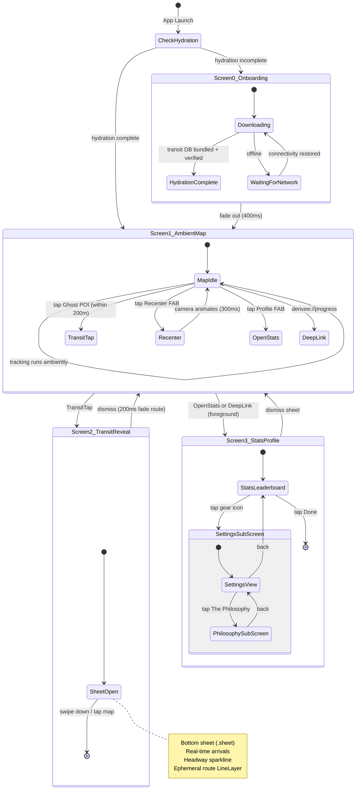
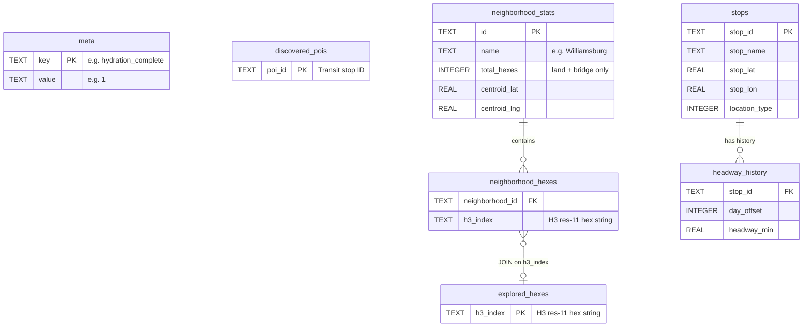

# Dérivée — Architecture UML Diagrams

This document provides visual architectural reference diagrams for agents and developers. For prose specifications, see [architecture.md](file:///Volumes/T7ssd/derivee/docs/architecture.md) and [design.md](file:///Volumes/T7ssd/derivee/docs/design.md).

---

## 1. Class Diagram (Ownership & Dependencies)

```mermaid
classDiagram
    direction TB

    class DeriveeApp {
        <<@main App>>
        +body: Scene
    }

    class ContentView {
        <<SwiftUI View>>
        -isHydrationComplete: Bool
        -isCheckingHydration: Bool
        -trackingEngine: AmbientTrackingEngine
        -spatialStore: SpatialStore
        -showTransitSheet: Bool
        -selectedTransitStop: String?
        -isMapCentered: Bool
        -recenterTrigger: Bool
        -showStatsView: Bool
        -userScreenPosition: CGPoint?
        -targetCoordinate: CLLocationCoordinate2D?
        -glowScale: CGFloat
        -glowOpacity: Double
    }

    class OnboardingView {
        <<SwiftUI View / Screen 0>>
        +trackingEngine: AmbientTrackingEngine
        +isHydrationComplete: Binding~Bool~
        -hydrationManager: HydrationManager
        -networkStatus: NWPath.Status
    }

    class MapView {
        <<UIViewRepresentable / Screen 1>>
        +colorScheme: ColorScheme
        +trackingEngine: AmbientTrackingEngine
        +spatialStore: SpatialStore
        +fogShape: MLNShape?
        +transientHexShape: MLNShape?
        +showTransitSheet: Binding~Bool~
        +selectedTransitStop: Binding~String?~
        +isCentered: Binding~Bool~
        +recenterTrigger: Binding~Bool~
        +userScreenPosition: Binding~CGPoint?~
        +targetCoordinate: Binding~CLLocationCoordinate2D?~
        +styleURL: URL
    }

    class Coordinator {
        <<MLNMapViewDelegate>>
        -mapView: MLNMapView
        -isMapStyleLoaded: Bool
        -pois: [GhostPOI]
        -lastLocation: CLLocation?
        +updateExploredHexes()
        +updateFogColor()
        +updateTransientHex()
        +updateTransitSheetState()
        +updatePOIs()
        +handleMapTap()
        +setupLayers()
    }

    class StatsView {
        <<SwiftUI View / Screen 3>>
        +trackingEngine: AmbientTrackingEngine
        +spatialStore: SpatialStore
        +targetCoordinate: Binding~CLLocationCoordinate2D?~
        -neighborhoods: [NeighborhoodProgress]
        -showFileImporter: Bool
    }

    class SettingsView {
        <<SwiftUI View / Screen 3b>>
        +trackingEngine: AmbientTrackingEngine
        +spatialStore: SpatialStore
        -showResetAlert: Bool
        -showCacheAlert: Bool
        -showPauseTrackingAlert: Bool
        -locationStatus: String
        -notificationsEnabled: Bool
    }

    class PhilosophyView {
        <<SwiftUI View / Screen 3c>>
    }

    class TransitRevealSheet {
        <<SwiftUI View / Screen 2>>
        +stopId: String
        -stopDetails: StopDetails?
        -headways: [Double]
    }

    class SpatialStore {
        <<@Observable, @unchecked Sendable>>
        +exploredHexes: Set~String~
        +currentFogShape: MLNShape?
        +transientHexShape: MLNShape?
        +discoveredPOIs: Set~String~
        +newlyDiscoveredPOIName: String?
        +newlyUnlockedHexLocation: CLLocationCoordinate2D?
        -observationTask: AnyDatabaseCancellable
        -polygonTask: Task
        -dbManager: SpatialDatabaseManager
        -liveUpdatePriority: TaskPriority
        +insertHex(h3Index)
        +discoverPOI(id, name)
        +clearData()
        -startObservation()
        -recomputeFogShape()
    }

    class SpatialDatabaseManager {
        <<Singleton, @unchecked Sendable>>
        +shared: SpatialDatabaseManager$
        +dbWriter: DatabaseWriter
        +configuredQoS: DispatchQoS
        +insertDiscoveredHex() async
        +insertHexesBatch() async
        +isHydrationComplete() async
        +setHydrationComplete() async
        +clearLocalCache() async
        +resetExplorationData() async
        +fetchNeighborhoodProgression() async
        +fetchNeighborhoodName() async
        +fetchStopDetails() async
        +fetchHeadwayData() async
        +loadDiscoveredPOIs() async
        +insertDiscoveredPOI() async
    }

    class AmbientTrackingEngine {
        <<@MainActor, ObservableObject>>
        -locationManager: CLLocationManager
        -backgroundSession: CLBackgroundActivitySession?
        -updatesTask: Task
        -lastLocation: CLLocation?
        -lastSavedHex: String?
        -currentActivity: Activity~TrackingAttributes~
        -sessionHexCount: Int
        +isTrackingEnabled: Bool
        +isTracking: Bool
        -locationProvider: LocationProvider
        -databaseManager: SpatialDatabaseManager
        +requestPermissions()
        +resumeTrackingIfNeeded()
        +startTracking()
        +stopTracking() async
        -processLocation()
    }

    class LocationProvider {
        <<Protocol>>
        +updates: AsyncStream~CLLocation~
    }

    class LiveLocationProvider {
        <<LocationProvider>>
        +updates: AsyncStream~CLLocation~
    }

    class GPXLocationProvider {
        <<LocationProvider>>
        -coordinates: [GPXCoordinate]
        -pacing: GPXPacingMode
        +updates: AsyncStream~CLLocation~
    }

    class HydrationManager {
        <<@Observable>>
        +progress: Double
        +isDownloading: Bool
        +error: Error?
        +hydrate() async
    }

    class PipelineLogger {
        <<Utility / Singleton>>
        +shared: PipelineLogger$
        +log(message)
    }

    class GPXProcessor {
        <<Utility>>
        -dbManager: SpatialDatabaseManager
        +processAndInsert(coordinates, userLocation, existingHexes, onProgress, onComplete)
    }

    class GPXParser {
        <<XMLParserDelegate>>
        +parse(url) → [GPXCoordinate]
    }

    class TransitRealtimeService {
        <<Service / SwiftProtobuf>>
        +shared: TransitRealtimeService
        +fetchLiveArrivals(for stopId, routeId) async → [ArrivalInfo]
        +parseFeedMessage(data, stopId, targetRouteId) → [ArrivalInfo]
    }

    class TransitRouteData {
        <<Static Data>>
        +lineInfo(for routeId) → LineInfo
        +loadRouteCoordinates(for stopOrRouteId) async → [CLLocationCoordinate2D]
    }

    class TransitSparklineView {
        <<SwiftUI View>>
        +headways: [Double]
        +title: String
    }

    class DiscoveryToast {
        <<SwiftUI View>>
        +stationName: String
        +onDismiss: Action
    }

    class MapFAB {
        <<SwiftUI Views>>
        RecenterFAB
        ProfileFAB
    }

    %% Ownership / Composition
    DeriveeApp *-- ContentView : creates

    ContentView *-- SpatialStore : @State owns
    ContentView *-- AmbientTrackingEngine : @StateObject owns
    ContentView *-- OnboardingView : shows (Screen 0)
    ContentView *-- MapView : shows (Screen 1)
    ContentView *-- TransitRevealSheet : .sheet (Screen 2)
    ContentView *-- StatsView : .sheet (Screen 3)
    ContentView *-- DiscoveryToast : overlay

    StatsView *-- SettingsView : NavigationLink (Screen 3b)
    SettingsView *-- PhilosophyView : NavigationLink (Screen 3c)

    MapView *-- Coordinator : makeCoordinator()
    Coordinator --> SpatialStore : reads fogShape

    %% Location Provider Subtyping
    LocationProvider <|.. LiveLocationProvider : implements
    LocationProvider <|.. GPXLocationProvider : implements
    AmbientTrackingEngine o-- LocationProvider : consumes

    %% Dependencies (uses)
    SpatialStore --> SpatialDatabaseManager : reads/writes via
    AmbientTrackingEngine --> SpatialDatabaseManager : insertDiscoveredHex
    HydrationManager --> SpatialDatabaseManager : setHydrationComplete
    OnboardingView --> HydrationManager : drives hydration

    TransitRevealSheet --> SpatialDatabaseManager : fetchStopDetails
    TransitRevealSheet --> TransitRealtimeService : polls GTFS-RT (15s)
    TransitRevealSheet --> TransitRouteData : route geometry
    TransitRevealSheet *-- TransitSparklineView : embeds

    StatsView --> SpatialDatabaseManager : fetchNeighborhoodProgression
    StatsView --> GPXProcessor : upload flow
    GPXProcessor --> GPXParser : parses XML
    GPXProcessor --> SpatialDatabaseManager : insertHexesBatch

    AmbientTrackingEngine ..> PipelineLogger : diagnostic logs
    SpatialStore ..> PipelineLogger : diagnostic logs

    MapView *-- MapFAB : overlay
```



---

## 2. Reactive Data Pipeline (The Core Loop)

### Overview

How a single GPS fix (or GPX coordinate) flows through the system to become a visible hole in the fog. There are **6 labeled stages** (`[S1]` through `[S6]`), logged via `PipelineLogger`.

```
GPS Fix / GPX Stream → Speed Gate → H3 Hash → Dedupe → DB Write (INSERT OR IGNORE) →
  → GRDB ValueObservation → Fog Recompute (CW bounds + CW holes) → MainActor Publish → MapLibre Metal GPU
```

### Full Sequence Diagram

```mermaid
sequenceDiagram
    participant iOS as iOS Location<br/>Services / GPX
    participant Stream as LocationProvider<br/>.updates Stream<br/>─ Detached Task
    participant ATE as AmbientTrackingEngine<br/>─ @MainActor<br/>processLocation()
    participant H3Lib as H3.latLngToCell<br/>─ Pure CPU math
    participant DetTask as Task.detached<br/>─ No actor
    participant GRDB as DatabasePool<br/>─ WAL / .userInitiated
    participant SQLite as explored_hexes<br/>─ INSERT OR IGNORE
    participant Hook as SQLite Update Hook<br/>─ GRDB internal
    participant VO as ValueObservation<br/>─ onChange callback
    participant SS as SpatialStore<br/>─ @Observable
    participant Fog as Task.detached<br/>─ .userInitiated<br/>recomputeFogShape()
    participant H3B as H3.cellToBoundary<br/>─ Per-hex loop
    participant MLN as MLNPolygon<br/>─ Constructor
    participant MA as MainActor.run
    participant SUI as SwiftUI<br/>@Observable diff
    participant Coord as MapView.Coordinator<br/>updateUIView()
    participant Src as MLNShapeSource<br/>fogSource.shape =
    participant GPU as MapLibre Metal<br/>GPU Pipeline

    Note over iOS, Stream: ── S1: Location Acquisition ──
    iOS->>Stream: CLLocationUpdate delivered / GPX yielded
    Stream->>ATE: for await location in updates
    Note right of ATE: AmbientTrackingEngine.swift:118

    Note over ATE, H3Lib: ── S2: Filtering & Hashing ──
    ATE->>ATE: Speed filter:<br/>speed > 12 m/s → discard
    Note right of ATE: Lines 151-171: Drift Gate
    ATE->>H3Lib: latLngToCell(lat, lng, resolution: 11)
    H3Lib-->>ATE: UInt64 cell index
    ATE->>ATE: String(index, radix: 16)
    ATE->>ATE: Dedupe: skip if == lastSavedHex
    Note right of ATE: Line 183: Short-circuit

    Note over DetTask, SQLite: ── S3: Database Write ──
    ATE->>DetTask: Task.detached { ... }
    Note right of DetTask: Line 186: Off @MainActor
    DetTask->>GRDB: insertDiscoveredHex(h3Index) async
    GRDB->>GRDB: Pool.get() — acquire write connection
    Note right of GRDB: QoS .userInitiated<br/>prevents priority inversion
    GRDB->>SQLite: INSERT OR IGNORE INTO explored_hexes
    SQLite-->>GRDB: changesCount > 0 → isNew: Bool
    GRDB-->>DetTask: return isNew

    Note over Hook, VO: ── S4: Reactive Observation ──
    SQLite->>Hook: SQLite update hook fires<br/>(row inserted in ROWID table)
    Hook->>VO: Region change detected:<br/>explored_hexes table
    VO->>VO: Re-fetch: SELECT all from explored_hexes
    VO->>SS: onChange(hexesArray)<br/>scheduled on .main queue
    Note right of SS: SpatialStore.swift:81

    Note over SS, MLN: ── S5: Fog Polygon Recomputation ──
    SS->>SS: Diff: newSet vs previousHexes
    SS->>SS: Detect newlyUnlockedCell (if any)
    SS->>Fog: recomputeFogShape(hexes, newlyUnlockedCell)
    Note right of Fog: Task.detached(priority: .userInitiated)<br/>SpatialStore.swift:109

    rect rgb(45, 45, 60)
        Note over Fog, MLN: Off-main-thread polygon math
        Fog->>Fog: Build 50km bounding box (CW)<br/>with jitter for cache invalidation
        loop For each hex in Set
            Fog->>H3B: cellToBoundary(cell)
            H3B-->>Fog: [LatLng] (CCW from H3)
            Fog->>Fog: .reverse() → CW winding<br/>Append closing vertex
            Fog->>MLN: MLNPolygon(coords, count)
        end
        Fog->>MLN: MLNPolygon(exterior: bounds,<br/>interiorPolygons: innerRings)
    end

    Note over MA, GPU: ── S6: Render Commit ──
    Fog->>MA: MainActor.run { self.currentFogShape = polygon }
    Note right of MA: SpatialStore.swift:181
    MA->>SS: currentFogShape = fogPolygon<br/>transientHexShape = hexPoly<br/>newlyUnlockedHexLocation = coord
    SS->>SUI: @Observable property change
    SUI->>Coord: updateUIView() called
    Coord->>Coord: updateExploredHexes(fogShape)
    Note right of Coord: MapView.swift:292
    Coord->>Src: fogSource.shape = validShape
    Src->>GPU: Triangulation → Metal render<br/>New hex hole appears in fog
```



### Stage-by-Stage Reference

| Stage | Label | File & Lines | Thread / Actor | What Happens |
|:---|:---|:---|:---|:---|
| S1 | Location Acquisition | `AmbientTrackingEngine.swift:117-121` | CLLocation stream → `@MainActor` | `for await` on `locationProvider.updates`. `CLBackgroundActivitySession` keeps app alive in background. |
| S2 | Filtering & Hashing | `AmbientTrackingEngine.swift:151-184` | `@MainActor` | Speed > 12 m/s → discard (drift gate). H3 Resolution 11 hash. Skip if same hex as last. |
| S3 | Database Write | `AmbientTrackingEngine.swift:186-210` | `Task.detached` → GRDB `DatabasePool` | `INSERT OR IGNORE` into `explored_hexes`. Returns `isNew: Bool`. |
| S4 | Reactive Observation | `SpatialStore.swift:63-103` | GRDB internal → `.main` queue | SQLite update hook fires → `ValueObservation` re-fetches → `onChange(hexesArray)`. Diffs `previousHexes` to find newly unlocked cell. |
| S5 | Fog Recomputation | `SpatialStore.swift:106-193` | `Task.detached(.userInitiated)` | Builds CW bounding box (with jitter). Loops H3 boundaries → reverses to CW → builds `MLNPolygon` with interior rings. |
| S6 | Render Commit | `MapView.swift:46-63`, `292-311` | `MainActor` → MapLibre Metal GPU | `currentFogShape` set → `@Observable` fires → `updateUIView()` → `fogSource.shape = validShape` → GPU triangulation. |

---

## 3. Screen Flow State Machine



---

## 4. MapLibre Active Layer Stack

The native map rendering stack in [MapView.swift](file:///Volumes/T7ssd/derivee/DeriveeNative/Derivee/MapView.swift#L227-L283) uses a Data-Driven Styling (DDS) architecture overlaid on MapTiler vector tiles:

```
▲ Top of Z-Stack
│
├── Layer 5: POI Hierarchy (poi-source)
│   ├── [Z: 5c] poi-archive-layer  (CircleLayer: r=6, opacity=0.15, minZoom=16.5)
│   ├── [Z: 5b] poi-active-layer   (SymbolLayer: subway diamond / bus dot)
│   └── [Z: 5a] poi-lure-layer     (CircleLayer: r=12..18 pulse, amber glow)
│
├── Layer 4: Ephemeral Route Inspection (ephemeral-route-source)
│   ├── [Z: 4b] ephemeral-route-layer         (LineLayer: 4pt MTA route color)
│   └── [Z: 4a] ephemeral-route-casing-layer  (LineLayer: 6pt semi-transparent white casing)
│
├── Layer 3: Transient Hex Unlock (transient-hex-source)
│   └── transient-hex-layer (FillLayer: 0.3 -> 0.0 opacity flash on new hex unlock)
│
├── Layer 2: The Fog Mask (fog-source)
│   ├── [Z: 2b] fog-border-layer (LineLayer: 1.5pt #FFB300 amber boundary outline, opacity 0.0 or 0.75)
│   └── [Z: 2a] cloud-layer      (FillLayer: 50km CW Bounding Box with CW H3 hex interior hole cutouts)
│       └── Opacity: 0.60..0.98 (@AppStorage) | Day: #1C1C1E | Night/OLED: #000000 | Transit: #0A0C10
│
└── Layer 1: Base Vector Style
    └── MapTiler Streets v2 (Coastlines, water, street grid, typography)
▼ Bottom of Z-Stack
```

---

## 5. Database Topology



| Database File | Attached As | Tables |
|:---|:---|:---|
| `derivee_spatial.sqlite` | *(main)* | `explored_hexes`, `meta`, `discovered_pois` |
| `derivee_transit.sqlite` | `transit` | `stops`, `headway_history` |
| `derivee_neighborhood.sqlite` | `neighborhood` | `neighborhood_stats`, `neighborhood_hexes` |

---

## 6. Architectural Isomorphisms & State Reductions

Dérivée achieves high performance and reliability through three mathematical and computational isomorphisms:

### A. The Spatial Isomorphism ($\mathbb{R}^2 \cong \mathbb{H}_{11} \cong \text{SQLite} \cong \text{Polygon Winding}$)
- **Discretization:** Continuous GPS space $(lat, lng) \in \mathbb{R}^2$ is mapped onto a discrete hexagonal lattice $\mathbb{H}_{11}$ via Uber H3 Resolution 11.
- **State Monoid $(\mathcal{P}(\mathbb{H}_{11}), \cup, \emptyset)$:**
  - Exploration state is strictly monotonic:
    $$S_{t+1} = S_t \cup \{h\}$$
  - Handled via idempotent `INSERT OR IGNORE INTO explored_hexes`. Replaying a walk (live GPS, GPX workout file, or mock simulation stream) yields identical output state.
- **Geometric Inversion:**
  $$\text{FogPolygon} = \text{BoundingBox}(50\text{km}) \setminus \bigcup_{h \in Explored} \text{HexBoundary}(h)$$
  Both exterior bounding boxes and interior holes require **Clockwise (CW)** winding in MapLibre Native.

### B. The Relational Projection Isomorphism
- Neighborhood exploration percentages are computed as indexed relational projections over attached SQLite tables:
  $$\text{Progress}(N) = \frac{|\text{explored\_hexes} \bowtie \text{neighborhood\_hexes}|}{\text{total\_hexes}}$$
  This executes in a single $<2\text{ms}$ indexed SQL query across attached databases, avoiding in-memory spatial point-in-polygon checks.

### C. The Unidirectional Reactive Pipeline Functor
- The entire application lifecycle is a pure unidirectional functor:
  $$\text{Location Fix} \longrightarrow \text{H3 Cell} \longrightarrow \text{SQLite Write} \longrightarrow \text{ValueObservation} \longrightarrow \text{Fog Shape} \longrightarrow \text{Metal GPU Triangulation}$$
  SQLite is the **single source of truth** and state reconciler; neither UI state nor view controllers maintain parallel spatial buffers.
