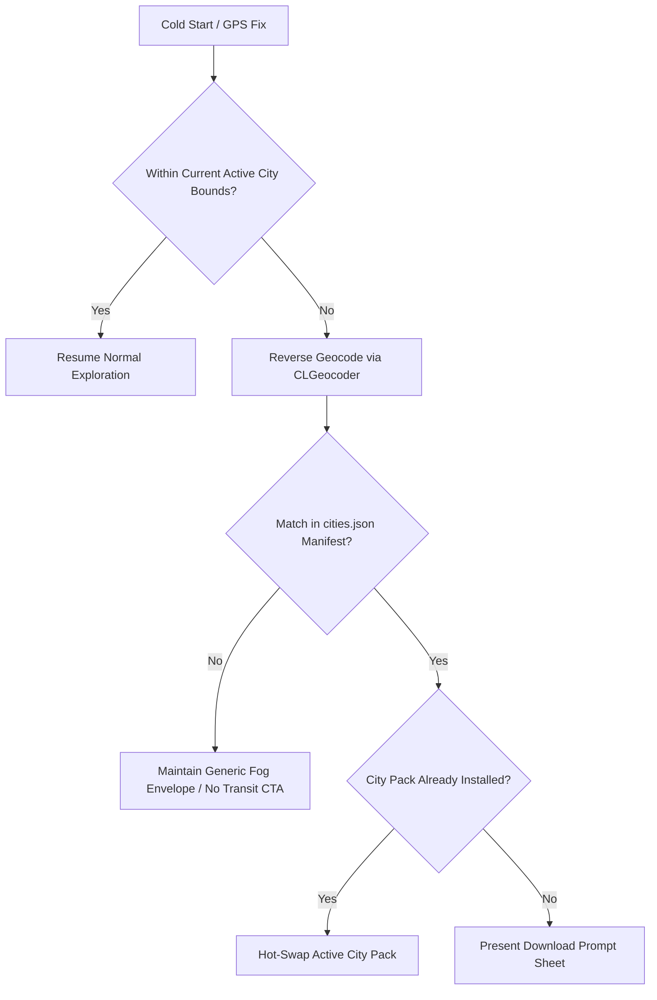
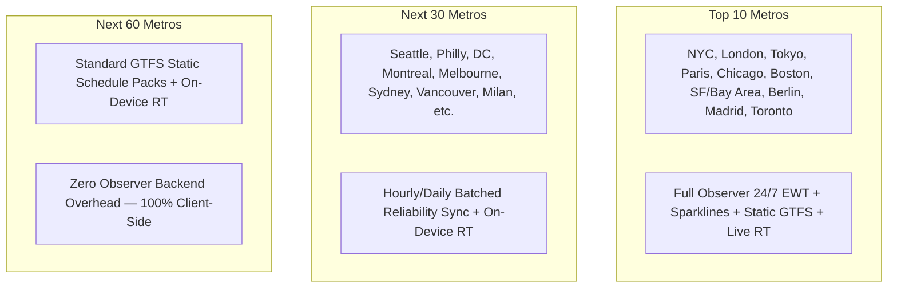

# Dérivée — Multi-City Architecture RFC

> **Status:** Proposed / Approved via Grilling Session (2024-08-24)  
> **Target Release:** Wave L (Sub-waves L.1–L.6)  
> **Primary Author:** Antigravity / Derivee Core Team  

---

## 1. Executive Summary & Problem Statement

Dérivée is currently hardcoded for the New York Metropolitan area:
1. **Hardcoded Fog Coordinates:** `FogPolygonMath.makeDefaultBounds()` and `MapView.swift` hardcode the NYC rectangular bounding box ($40.0^\circ\text{N} \dots 41.5^\circ\text{N}, -74.5^\circ\text{W} \dots -73.0^\circ\text{W}$).
2. **Hardcoded Camera Clamping:** `CameraBounds.swift` strictly enforces camera movement within NYC latitude/longitude envelopes.
3. **Bundled Heavy Assets:** NYC's `derivee_transit.sqlite` (~1.7 MB) and `neighborhood.sqlite` (~21 MB) are bundled directly inside the iOS app binary. Bundling 5–10 cities would cause the app binary size to swell past 200+ MB.
4. **Hardcoded Transit Line Geometries:** `MtaSubwayNetworkData.swift` embeds static NYC subway trunk route coordinates in Swift code rather than loading dynamic GeoJSON per city.

**The Multi-City Vision:** Dérivée remains an offline-first, ambient experience that seamlessly detects when a user arrives in a new metropolitan area, prompts them to download a compact, Zstandard-compressed **City Pack** on demand (~35–45 MB), and dynamically adapts the fog bounds, camera clamping, transit routing, and exploration history without bloating the base application bundle.

---

## 2. City Detection & Location Triggering

City detection operates automatically without requiring manual user configuration, while respecting battery and network constraints:



1. **Cold-Start Check:** On obtaining the first high-accuracy GPS fix ($\le 25\text{m}$), `AmbientTrackingEngine` evaluates if the coordinate lies within `CameraBounds.isWithinBounds()`.
2. **Significant Location Change Trigger:** While backgrounded, `CLMonitor` / Significant Location Change service wakes the app if the user travels $> 50\text{km}$ (e.g. airport departure/arrival).
3. **Reverse Geocoding:** `CLGeocoder.reverseGeocodeLocation` resolves the locality (e.g. "Boston", "Chicago", "London").
4. **Manifest Resolution:** Matches the locality against the cached `cities.json` manifest hosted on Cloudflare R2.
5. **Prompt Presentation:** If uninstalled, presents the non-blocking `CityDownloadPromptSheet`.

---

## 3. City Pack Bundle Format & R2 CDN Pipeline

All city assets are bundled into a single atomic, compressed archive to prevent partial download corruption.

### 3.1 City Pack Directory Structure (`city-{slug}.pack.zst`)

```
city-bos.pack/
├── city_config.json          # Bounding box, camera defaults, multi-modal feeds, attributions, metadata
├── transit.sqlite            # GRDB SQLite database (stops, routes, scheduled_hourly_patterns)
└── transit-lines.geojson     # Line geometries (Subway, PATH, Maritime Ferry) with hex colors & properties
```

### 3.2 `city_config.json` Schema

```json
{
  "version": 1,
  "slug": "nyc",
  "displayName": "New York City",
  "region": "New York, USA",
  "bounds": {
    "minLatitude": 40.48,
    "maxLatitude": 40.95,
    "minLongitude": -74.28,
    "maxLongitude": -73.68
  },
  "center": {
    "latitude": 40.7128,
    "longitude": -74.0060,
    "defaultZoom": 13.0
  },
  "transit": {
    "agencyName": "Metropolitan Transportation Authority",
    "attributions": [
      "MTA New York City Transit",
      "Port Authority of NY & NJ",
      "NYC Ferry by Hornblower",
      "Roosevelt Island Operating Corp"
    ],
    "realtimeFeeds": {
      "subway_numbered": "https://api-endpoint.mta.info/Dataservice/mtagtfsfeeds/nyct%2Fgtfs",
      "subway_lettered_ace": "https://api-endpoint.mta.info/Dataservice/mtagtfsfeeds/nyct%2Fgtfs-ace",
      "subway_lettered_bdfm": "https://api-endpoint.mta.info/Dataservice/mtagtfsfeeds/nyct%2Fgtfs-bdfm",
      "subway_lettered_g": "https://api-endpoint.mta.info/Dataservice/mtagtfsfeeds/nyct%2Fgtfs-g",
      "subway_lettered_jz": "https://api-endpoint.mta.info/Dataservice/mtagtfsfeeds/nyct%2Fgtfs-jz",
      "subway_lettered_nqrw": "https://api-endpoint.mta.info/Dataservice/mtagtfsfeeds/nyct%2Fgtfs-nqrw",
      "subway_lettered_l": "https://api-endpoint.mta.info/Dataservice/mtagtfsfeeds/nyct%2Fgtfs-l",
      "subway_sir": "https://api-endpoint.mta.info/Dataservice/mtagtfsfeeds/nyct%2Fgtfs-si",
      "bus": "https://gtfsrt.prod.obanyc.com/tripUpdates",
      "path": "https://path.api.panynj.gov/gtfsrealtime",
      "ferry": "https://api.ferry.nyc/gtfs-rt"
    },
    "staticGtfsSources": [
      "http://web.mta.info/developers/data/nyct/subway/google_transit.zip",
      "http://web.mta.info/developers/data/nyct/bus/google_transit_manhattan.zip",
      "http://web.mta.info/developers/data/nyct/bus/google_transit_brooklyn.zip",
      "http://web.mta.info/developers/data/nyct/bus/google_transit_queens.zip",
      "http://web.mta.info/developers/data/nyct/bus/google_transit_bronx.zip",
      "http://web.mta.info/developers/data/nyct/bus/google_transit_staten_island.zip",
      "https://www.panynj.gov/path/gtfs/google_transit.zip",
      "https://www.ferry.nyc/gtfs/google_transit.zip"
    ]
  },
  "sha256": "e3b0c44298fc1c149afbf4c8996fb92427ae41e4649b934ca495991b7852b855"
}
```

### 3.3 Compact Static Timetable Schema (`transit.sqlite`)

Rather than ingesting 1.8 million raw `stop_times` rows, `transit.sqlite` pre-aggregates departures into compact hourly minute-offset arrays:

```sql
CREATE TABLE scheduled_hourly_patterns (
    stop_id TEXT NOT NULL,
    route_id TEXT NOT NULL,
    direction_id INTEGER NOT NULL,
    day_of_week INTEGER NOT NULL, -- 0 = Sunday ... 6 = Saturday
    hour_of_day INTEGER NOT NULL, -- 0 ... 23
    minute_offsets TEXT NOT NULL, -- e.g. "04,16,28,40,52"
    headsign TEXT NOT NULL,
    PRIMARY KEY (stop_id, route_id, direction_id, day_of_week, hour_of_day)
);
CREATE INDEX idx_patterns_lookup ON scheduled_hourly_patterns(stop_id, route_id, direction_id);
```

- **Compression & Performance:** Drops database size from ~110 MB to **~4.5 MB uncompressed** (< 1.2 MB Zstandard compressed). Queries execute in < 0.5ms.

### 3.4 Remote Manifest (`cities.json`)

Hosted at `https://cdn.derivee.app/cities.json` (backed by Cloudflare R2):

```json
{
  "version": 1,
  "lastUpdated": "2026-08-24T00:00:00Z",
  "cities": [
    {
      "slug": "nyc",
      "displayName": "New York City",
      "region": "New York, USA",
      "compressedSizeBytes": 12800000,
      "uncompressedSizeBytes": 28500000,
      "isBundled": true,
      "version": "1.1.0"
    },
    {
      "slug": "bos",
      "displayName": "Boston",
      "region": "Massachusetts, USA",
      "compressedSizeBytes": 9400000,
      "uncompressedSizeBytes": 22100000,
      "isBundled": false,
      "version": "1.0.0"
    }
  ]
}
```

---

## 4. Database Architecture: The Single-Active `ATTACH` Pattern

To prevent multi-database connection bloat and avoid rewriting existing queries, Dérivée uses a **Single-Active `ATTACH`** hot-swap model.

```mermaid
flowchart LR
    subgraph App Database [SpatialDatabaseManager dbWriter]
        A[explored_hexes_nyc]
        B[explored_hexes_bos]
        C[explored_hexes_chi]
    end

    subgraph Attached Schema [AS transit]
        D[transit.sqlite for Active City]
    end

    App Database ---|ATTACH / DETACH| D
```

### 4.1 Hot-Swap Execution
When switching active cities:
```sql
DETACH DATABASE transit;
ATTACH DATABASE '/var/mobile/.../Documents/CityPacks/bos/transit.sqlite' AS transit;
```

### 4.2 Query Independence
All existing database read methods (`fetchStopDetails`, `fetchStopEvents`, `fetchHeadwayData`, `inferBusRoutes`) remain **100% unchanged** because they query tables using the schema alias `transit.stops`, `transit.stop_events`, and `transit.routes`.

### 4.3 Exploration Isolation
Exploration history is permanently preserved per city using dedicated tables in the primary SQLite store:
- `explored_hexes_nyc (h3_index TEXT PRIMARY KEY)`
- `explored_hexes_bos (h3_index TEXT PRIMARY KEY)`
- `SpatialStore` observes only the active city's table, avoiding cross-city H3 dissolution overhead.

---

---

## 5. Dynamic Map & Multi-Modal Geometry Pipeline

### 5.1 Dynamic `CameraBounds`
`CameraBounds` transitions from static constants to a configuration-backed model:
```swift
public struct CameraBounds {
    public static var activeConfig: CityConfig = .nycDefault
    
    public static var minLatitude: Double { activeConfig.bounds.minLatitude }
    public static var maxLatitude: Double { activeConfig.bounds.maxLatitude }
    public static var minLongitude: Double { activeConfig.bounds.minLongitude }
    public static var maxLongitude: Double { activeConfig.bounds.maxLongitude }
    public static let rubberBandMargin: Double = 0.05 // Strict 5km edge limit
}
```

### 5.2 Dynamic Fog Bounds & Water Fog Policy
- `FogPolygonMath.makeBounds(for config: CityConfig)` computes the 5-point rectangular exterior bounds directly from `activeConfig.bounds`.
- **Strict Land-Only Fog Policy:** Open water bodies (rivers, bays, ocean) are excluded from the H3 exploration tracking engine. Ferry trips across water do not punch holes through open water polygons; exploration clearance occurs strictly on terrestrial landmass, pedestrian bridges, and ferry landing piers.

### 5.3 Unified GeoJSON Multi-Modal Transit Loader
1. Delete hardcoded `MtaSubwayNetworkData.swift`.
2. Move NYC geometries to `city-nyc.pack/transit-lines.geojson`.
3. `MapView.Coordinator` loads dynamic `MLNShapeSource` layers with distinct modal treatments:
   - **Subway (NYCT):** 4px solid line in official MTA line colors + 6px light silver casing (`#E0E0DC`). 4.5pt circle station discs.
   - **PATH:** 4px solid line in official PATH brand colors (Red `#E03A3E`, Green `#00A3E0`, Yellow `#FFC72C`, Blue `#009639`) + 6px silver casing.
   - **Maritime Ferry (NYC Ferry):** 2.5pt dashed line (`#00A3E0` with 4pt dash) over water polygons with custom pier landing pins.
   - **Bus Capillary Network:** Preserves the dynamic **Nearby Bus Lens** appearing at zoom $\ge 14.5$ as subtle `#00A1DE` dots.
4. **Regional Boundary Policy:** Commuter rail (LIRR, Metro-North, NJ Transit) and statewide express bus networks are indexed as terminal hub POIs (Penn Station, Grand Central, PABT, GWB Terminal) with 3-tier hierarchical resolution, while excluding statewide 19,000+ suburban bus stops and intercity rail lines to preserve the **<45 MB package size limit**.

---

## 6. User Experience, Timetable Navigation & Attributions

1. **Non-Blocking Modal Presentation:** When a new city is detected, a bottom sheet appears above the map:
   - *"Exploring Boston? Download transit network & offline map (≈22 MB)."*
   - Actions: `[ Download Now ]` (Primary) / `[ Not Now ]` (Secondary).
2. **Download & Verification:**
   - Streamed download via `URLSessionDownloadTask` with progress tracking.
   - Decompressed via native `libcompression` into `~/Documents/CityPacks/{slug}/`.
   - Verified against `sha256` checksum before activating.
   - **Zero-Download NYC First Launch:** The base app bundle includes `city-nyc.pack.zst`, uncompressed locally on first launch in <200ms with zero network dependency.
3. **$\pm 7$ Day Timetable Navigation (Observed Reality Replay):**
   - **Today (Live):** Real-time GTFS-RT countdown overlays, delay badges (`+4m`), and pulsing live indicators.
   - **Future Days ($+1 \dots +7$):** Pure scheduled baseline for that day of week.
   - **Past Days ($-7 \dots -1$):** **Observed Reality Replay** rendering green/amber/red departure pills with actual recorded arrival times from `stop_events`.
4. **Transit Agency Attributions:**
   - Data source citations (e.g. *"Data provided by MTA New York City Transit, Port Authority of NY & NJ, and NYC Ferry"*) rendered in sheet footers and `Settings > About & Open Data`.
5. **Settings Manager:** A new **Settings > Cities** screen enables:
   - Viewing installed vs available cities.
   - Manual download / storage deletion.
   - Manual active city switching.

---

## 7. Observer Daemon Multi-City Strategy

### 7.1 Phase 1 (Wave L.6 — Boston Launch): Static GTFS Only
- Boston launches using static GTFS schedules pre-compiled into `city-bos.pack/transit.sqlite`.
- Timetables and departure matrices function fully offline.
- Real-time GTFS-RT Protobuf arrivals parse directly from MBTA feeds on-device.
- Historical sparklines and 24×7 OTP heatmaps show static defaults.

### 7.2 Phase 2 (Future Wave — Multi-Feed Daemon):
- Observer daemon is updated to iterate through an array of `CityFeedConfig` entries.
- Generates `transit_delta_{slug}.sqlite.zst` per city.
- Nightly cron sync downloads deltas only for currently installed city packs.

### 7.3 Free-Tier Capacity & 100-City Scaling Analysis

Dérivée is engineered to operate 100% within the Free Tiers of Cloudflare (R2 + CDN) and Oracle Cloud Infrastructure (OCI Always Free ARM), scaling from 2 cities to 100+ metropolitan regions with zero infrastructure cost.

#### 1. Cloudflare R2 & CDN Capacity Budget (100 Cities)

| Resource | Cloudflare Free Limit | 100-City Projection | Free Tier Consumption |
| :--- | :--- | :--- | :--- |
| **R2 Storage** | **10 GB / month** | 100 packs × ~15 MB avg compressed `.pack.zst` = **~1.5 GB** | **15.0%** |
| **Egress Bandwidth** | **Unlimited ($0 / GB)** | 100% Free on Cloudflare R2 | **0% ($0.00)** |
| **Class B Ops (Reads)** | **10,000,000 / month** | Packs downloaded once per city per user. Cloudflare edge CDN (`cdn.derivee.app`) caches `cities.json` and static packs, absorbing >95% of requests. | **< 2.0%** |
| **Class A Ops (Writes)** | **1,000,000 / month** | Hourly historical delta sync: $100 \times 24 \times 30 = \mathbf{72{,}000\text{ writes/mo}}$. Nightly sync: $\mathbf{3{,}000\text{ writes/mo}}$. | **0.3% – 7.2%** |

> [!IMPORTANT]
> **R2 Class A Upload Cadence Mandate:** While single-city local development uploads `transit_delta.sqlite.zst` every 3 minutes (14.4k writes/mo), a 100-city fleet at 3-minute intervals would generate $1.44\text{M}$ writes/month (exceeding the 1M free tier by 440k ops). Therefore, multi-city historical delta uploads **must be batched hourly or nightly**. Real-time arrivals are parsed directly on-device from agency Protobuf feeds and never touch R2.

#### 2. Oracle Cloud (OCI Always Free ARM) Compute Budget (100 Cities)

| Resource | OCI Ampere A1 Free Limit | 100-City Observer Daemon Load | Free Tier Consumption |
| :--- | :--- | :--- | :--- |
| **Memory** | **24 GB RAM** | ~1.5 GB – 3.0 GB RSS across 100 in-memory trip tracking engines | **< 15.0%** |
| **CPU** | **4 OCPUs (ARM)** | ~33 feed fetches/min; consumes ~5–10% of 1 core via Go worker goroutines | **< 5.0%** |
| **Disk Storage** | **200 GB SSD** | 100 cities × ~70 MB static GTFS SQLite = **~7 GB** (with 30-day auto-pruning) | **3.5%** |
| **Outbound Transfer** | **10 TB / month** | 100 cities × hourly delta uploads = **~7.2 GB / month** | **0.07%** |

#### 3. Three-Tier Metro Rollout Model



1. **Tier 1 (Flagship Metros — Top 10):** High-density subway/bus trunk lines. Full 24/7 historical reliability calculation, headway variance matrices, and real-time transit sheets.
2. **Tier 2 (Major Regional Metros — Next 30):** Standardized GTFS/GTFS-RT feeds with hourly or daily batched reliability aggregations.
3. **Tier 3 (Mid/Regional Metros — Next 60+):** Static schedule matrix bundles (`city-{slug}.pack.zst`) with live on-device Protobuf arrival parsing. These require **zero continuous server computing** on the Observer daemon.

---

## 8. Wave L Implementation Roadmap

| Sub-Wave | Task ID | Deliverable | Scope |
|:---|:---|:---|:---:|
| **L.1** | `WL1-CITY-PACK-INFRA` | `CityPackManager`, decompression, R2 manifest fetcher, multi-modal `city_config.json`, bundled NYC pack | **M** |
| **L.2** | `WL2-DYNAMIC-BOUNDS-FOG` | Dynamic `CameraBounds`, per-city `explored_hexes_{slug}`, land-only water fog masking | **M** |
| **L.3** | `WL3-TRANSIT-HOT-SWAP` | SQLite `DETACH`/`ATTACH` engine, multi-modal `transit.sqlite` (Subway+PATH+Ferry+Bus), $\pm 7$ day timetable navigation | **M** |
| **L.4** | `WL4-GEOJSON-TRANSIT-LOADER` | Multi-modal GeoJSON loader (Subway/PATH/Maritime Ferry), retire `MtaSubwayNetworkData.swift` | **M** |
| **L.5** | `WL5-CITY-DETECTION-UX` | `CLGeocoder` city trigger, download prompt sheet, agency attributions, Settings city manager | **M** |
| **L.6** | `WL6-BOSTON-MBTA-PACK` | MBTA GTFS multi-modal pipeline (Subway+LRT+BRT+Ferry), `city-bos.pack.zst`, R2 upload | **M** |

