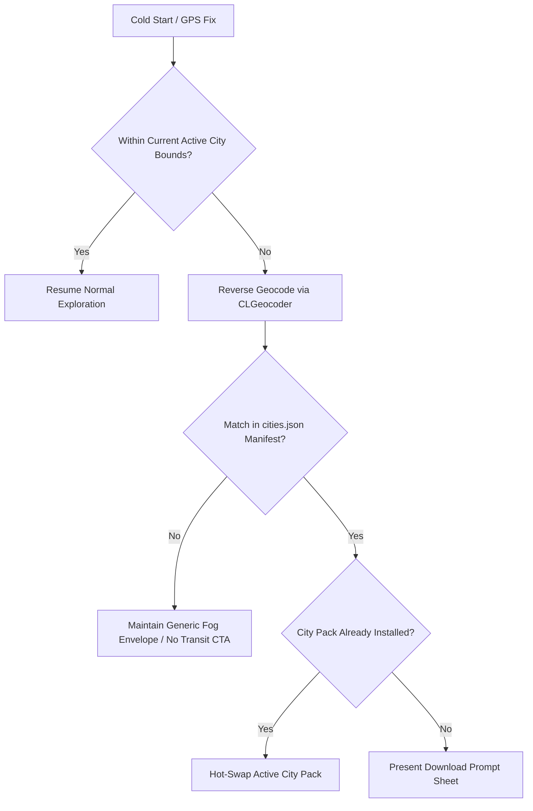

# Dérivée — Multi-City Architecture RFC

> **Status:** Proposed / Approved via Grilling Session (2024-08-24)  
> **Target Release:** Wave L (Sub-waves L.1–L.6)  
> **Primary Author:** Antigravity / Derivee Core Team  

---

## 1. Executive Summary & Problem Statement

Dérivée is currently hardcoded for the New York Metropolitan area:
1. **Hardcoded Fog Coordinates:** `FogPolygonMath.makeDefaultBounds()` and `MapView.swift` hardcode the NYC rectangular bounding box ($40.0^\circ\text{N} \dots 41.5^\circ\text{N}, -74.5^\circ\text{W} \dots -73.0^\circ\text{W}$).
2. **Hardcoded Camera Clamping:** `CameraBounds.swift` strictly enforces camera movement within NYC latitude/longitude envelopes.
3. **Bundled Heavy Assets:** NYC's `derivee_transit.sqlite` (~1.7 MB) and `neighborhood.sqlite` (~21 MB) are bundled directly inside the iOS app binary. Bundling 5–10 cities would cause the app binary size to swell past 200+ MB.
4. **Hardcoded Transit Line Geometries:** `MtaSubwayNetworkData.swift` embeds static NYC subway trunk route coordinates in Swift code rather than loading dynamic GeoJSON per city.

**The Multi-City Vision:** Dérivée remains an offline-first, ambient experience that seamlessly detects when a user arrives in a new metropolitan area, prompts them to download a compact, Zstandard-compressed **City Pack** on demand (~35–45 MB), and dynamically adapts the fog bounds, camera clamping, transit routing, and exploration history without bloating the base application bundle.

---

## 2. City Detection & Location Triggering

City detection operates automatically without requiring manual user configuration, while respecting battery and network constraints:



1. **Cold-Start Check:** On obtaining the first high-accuracy GPS fix ($\le 25\text{m}$), `AmbientTrackingEngine` evaluates if the coordinate lies within `CameraBounds.isWithinBounds()`.
2. **Significant Location Change Trigger:** While backgrounded, `CLMonitor` / Significant Location Change service wakes the app if the user travels $> 50\text{km}$ (e.g. airport departure/arrival).
3. **Reverse Geocoding:** `CLGeocoder.reverseGeocodeLocation` resolves the locality (e.g. "Boston", "Chicago", "London").
4. **Manifest Resolution:** Matches the locality against the cached `cities.json` manifest hosted on Cloudflare R2.
5. **Prompt Presentation:** If uninstalled, presents the non-blocking `CityDownloadPromptSheet`.

---

## 3. City Pack Bundle Format & R2 CDN Pipeline

All city assets are bundled into a single atomic, compressed archive to prevent partial download corruption.

### 3.1 City Pack Directory Structure (`city-{slug}.pack.zst`)

```
city-bos.pack/
├── city_config.json          # Bounding box, camera defaults, feeds, metadata
├── transit.sqlite            # GRDB SQLite database (stops, routes, stop_times)
└── transit-lines.geojson     # Line geometries with hex colors & properties
```

### 3.2 `city_config.json` Schema

```json
{
  "version": 1,
  "slug": "bos",
  "displayName": "Boston",
  "region": "Massachusetts, USA",
  "bounds": {
    "minLatitude": 42.15,
    "maxLatitude": 42.55,
    "minLongitude": -71.30,
    "maxLongitude": -70.85
  },
  "center": {
    "latitude": 42.3601,
    "longitude": -71.0589,
    "defaultZoom": 13.0
  },
  "transit": {
    "agencyName": "MBTA",
    "realtimeFeeds": {
      "subway": "https://api-v3.mbta.com/trip-updates",
      "bus": "https://api-v3.mbta.com/trip-updates"
    },
    "staticGtfsSource": "https://cdn.mbta.com/MBTA_GTFS.zip"
  },
  "sha256": "e3b0c44298fc1c149afbf4c8996fb92427ae41e4649b934ca495991b7852b855"
}
```

### 3.3 Remote Manifest (`cities.json`)

Hosted at `https://cdn.derivee.app/cities.json` (backed by Cloudflare R2):

```json
{
  "version": 1,
  "lastUpdated": "2026-08-24T00:00:00Z",
  "cities": [
    {
      "slug": "nyc",
      "displayName": "New York City",
      "region": "New York, USA",
      "compressedSizeBytes": 22800000,
      "uncompressedSizeBytes": 38500000,
      "isBundled": true,
      "version": "1.0.4"
    },
    {
      "slug": "bos",
      "displayName": "Boston",
      "region": "Massachusetts, USA",
      "compressedSizeBytes": 18400000,
      "uncompressedSizeBytes": 32100000,
      "isBundled": false,
      "version": "1.0.0"
    }
  ]
}
```

---

## 4. Database Architecture: The Single-Active `ATTACH` Pattern

To prevent multi-database connection bloat and avoid rewriting existing queries, Dérivée uses a **Single-Active `ATTACH`** hot-swap model.

```mermaid
flowchart LR
    subgraph App Database [SpatialDatabaseManager dbWriter]
        A[explored_hexes_nyc]
        B[explored_hexes_bos]
        C[explored_hexes_chi]
    end

    subgraph Attached Schema [AS transit]
        D[transit.sqlite for Active City]
    end

    App Database ---|ATTACH / DETACH| D
```

### 4.1 Hot-Swap Execution
When switching active cities:
```sql
DETACH DATABASE transit;
ATTACH DATABASE '/var/mobile/.../Documents/CityPacks/bos/transit.sqlite' AS transit;
```

### 4.2 Query Independence
All existing database read methods (`fetchStopDetails`, `fetchStopEvents`, `fetchHeadwayData`, `inferBusRoutes`) remain **100% unchanged** because they query tables using the schema alias `transit.stops`, `transit.stop_events`, and `transit.routes`.

### 4.3 Exploration Isolation
Exploration history is permanently preserved per city using dedicated tables in the primary SQLite store:
- `explored_hexes_nyc (h3_index TEXT PRIMARY KEY)`
- `explored_hexes_bos (h3_index TEXT PRIMARY KEY)`
- `SpatialStore` observes only the active city's table, avoiding cross-city H3 dissolution overhead.

---

## 5. Dynamic Map & Geometry Pipeline

### 5.1 Dynamic `CameraBounds`
`CameraBounds` transitions from static constants to a configuration-backed model:
```swift
public struct CameraBounds {
    public static var activeConfig: CityConfig = .nycDefault
    
    public static var minLatitude: Double { activeConfig.bounds.minLatitude }
    public static var maxLatitude: Double { activeConfig.bounds.maxLatitude }
    public static var minLongitude: Double { activeConfig.bounds.minLongitude }
    public static var maxLongitude: Double { activeConfig.bounds.maxLongitude }
    public static let rubberBandMargin: Double = 0.05 // Strict 5km edge limit
}
```

### 5.2 Dynamic Fog Bounds
`FogPolygonMath.makeBounds(for config: CityConfig)` computes the 5-point rectangular exterior bounds directly from `activeConfig.bounds`.

### 5.3 Unified GeoJSON Subway Loader
1. Delete hardcoded `MtaSubwayNetworkData.swift`.
2. Move NYC geometry to `city-nyc.pack/transit-lines.geojson`.
3. `MapView.Coordinator` loads `MLNShapeSource` by parsing GeoJSON directly from the active city pack directory.
4. Line styling extracts `stroke` or `color` feature properties from GeoJSON for agency-accurate rendering.

---

## 6. User Experience & Download Flow

1. **Non-Blocking Modal Presentation:** When a new city is detected, a bottom sheet appears above the map:
   - *"Exploring Boston? Download transit network & offline map (≈38 MB)."*
   - Actions: `[ Download Now ]` (Primary) / `[ Not Now ]` (Secondary).
2. **Download & Verification:**
   - Streamed download via `URLSessionDownloadTask` with progress tracking.
   - Decompressed via native `libcompression` into `~/Documents/CityPacks/{slug}/`.
   - Verified against `sha256` checksum before activating.
3. **Graceful Fallback:** If declined, the user can continue exploring the map with full Fog of War and GPS tracking, but transit nodes display: *"Transit data not installed for this city — Tap to download."*
4. **Settings Manager:** A new **Settings > Cities** screen enables:
   - Viewing installed vs available cities.
   - Manual download / storage deletion.
   - Manual active city switching.

---

## 7. Observer Daemon Multi-City Strategy

### 7.1 Phase 1 (Wave L.6 — Boston Launch): Static GTFS Only
- Boston launches using static GTFS schedules pre-compiled into `city-bos.pack/transit.sqlite`.
- Timetables and departure matrices function fully offline.
- Real-time GTFS-RT Protobuf arrivals parse directly from MBTA feeds on-device.
- Historical sparklines and 24×7 OTP heatmaps show static defaults.

### 7.2 Phase 2 (Future Wave — Multi-Feed Daemon):
- Observer daemon is updated to iterate through an array of `CityFeedConfig` entries.
- Generates `transit_delta_{slug}.sqlite.zst` per city.
- Nightly cron sync downloads deltas only for currently installed city packs.

---

## 8. Wave L Implementation Roadmap

| Sub-Wave | Task ID | Deliverable | Scope |
|:---|:---|:---|:---:|
| **L.1** | `WL1-CITY-PACK-INFRA` | `CityPackManager`, decompression, R2 manifest fetcher, bundled NYC pack | **M** |
| **L.2** | `WL2-DYNAMIC-BOUNDS-FOG` | Dynamic `CameraBounds`, per-city `explored_hexes_{slug}`, fog recomputation | **M** |
| **L.3** | `WL3-TRANSIT-HOT-SWAP` | SQLite `DETACH`/`ATTACH` engine, fallback empty states, GRDB observation survival | **S** |
| **L.4** | `WL4-GEOJSON-SUBWAY-LOADER` | GeoJSON shape loader, retire `MtaSubwayNetworkData.swift`, NYC pack migration | **M** |
| **L.5** | `WL5-CITY-DETECTION-UX` | `CLGeocoder` city trigger, download prompt sheet, Settings city manager | **M** |
| **L.6** | `WL6-BOSTON-MBTA-PACK` | MBTA GTFS pipeline, `city-bos.pack.zst` build, R2 upload, end-to-end field test | **M** |
