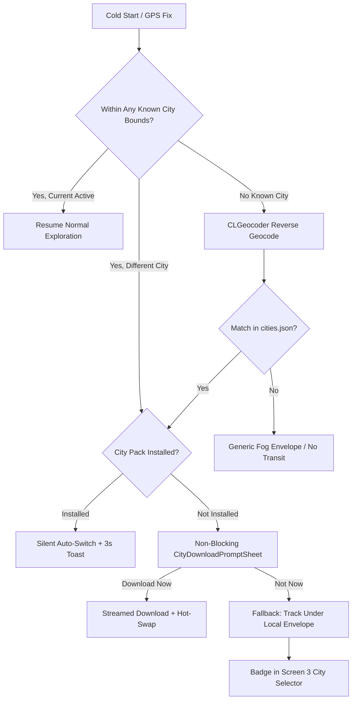
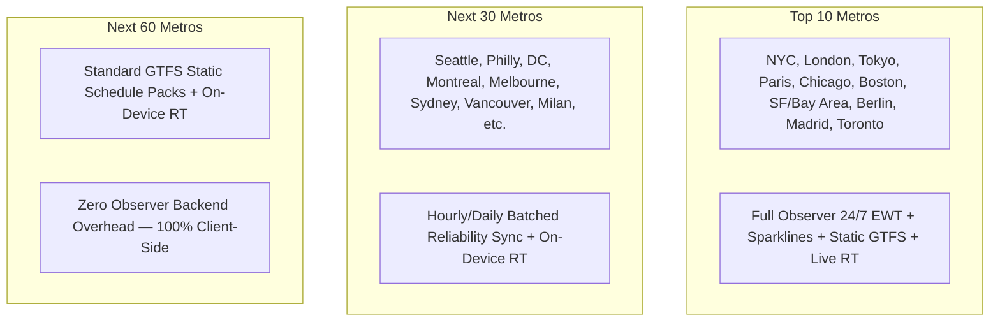

# Dérivée — Multi-City Architecture RFC

> **Status:** Approved via Grilling Session (2026-08-24)  
> **Target Release:** Wave L (Sub-waves L.1–L.6)  
> **Primary Author:** Antigravity / Derivee Core Team  
> **Last Updated:** 2026-08-24 — Incorporated all 5 grilling decisions (Dual 14-day bitmask, universal pre-interpolation, 4-tier modal mapping with commuter rail bounding, curated registry with 12h delta polling, and mode-adaptive circular distance matching)

---

## 1. Executive Summary & Problem Statement

Dérivée is currently hardcoded for the New York Metropolitan area:
1. **Hardcoded Fog Coordinates:** `FogPolygonMath.makeDefaultBounds()` and `MapView.swift` hardcode the NYC rectangular bounding box ($40.0^\circ\text{N} \dots 41.5^\circ\text{N}, -74.5^\circ\text{W} \dots -73.0^\circ\text{W}$).
2. **Hardcoded Camera Clamping:** `CameraBounds.swift` strictly enforces camera movement within NYC latitude/longitude envelopes.
3. **Bundled Heavy Assets:** NYC's `derivee_transit.sqlite` (~1.7 MB) and `neighborhood.sqlite` (~21 MB) are bundled directly inside the iOS app binary. Bundling 5–10 cities would cause the app binary size to swell past 200+ MB.
4. **Hardcoded Transit Line Geometries:** `MtaSubwayNetworkData.swift` embeds static NYC subway trunk route coordinates in Swift code rather than loading dynamic GeoJSON per city.

**The Multi-City Vision:** Dérivée remains an offline-first, ambient experience that seamlessly detects when a user arrives in a new metropolitan area, prompts them to download a compact, Zstandard-compressed **City Pack** on demand (~15–35 MB), and dynamically adapts the fog bounds, camera clamping, transit routing, and exploration history without bloating the base application bundle.

### 1.1 Automated Global Feed Discovery & Ingestion Pipeline (The Observer)

To ensure zero-downtime timetable updates across target metropolitan regions, The Observer (a headless Go daemon deployed on an OCI Always Free ARM instance) automates feed discovery, schedule compaction, and packaging via three primary programmatic discovery protocols:

1. **MobilityData (The Mobility Database Catalog API v1):**
   - Endpoint: `https://api.mobilitydatabase.org/v1/gtfs_feeds`
   - Authentication: OAuth2 Client Credentials flow. Daemon exchanges a long-lived refresh token via `POST https://api.mobilitydatabase.org/v1/tokens` for a short-lived Bearer Access Token (1-hour validity).
   - Version Tracking: `GET /v1/gtfs_feeds/{id}` and `GET /v1/datasets/gtfs/{id}`. Rate limits governed by exponential HTTP 429 back-off.
2. **Transitland v2 REST API:**
   - Endpoint: `https://transit.land/api/v2/rest/feeds`
   - Authentication: `apikey` query parameter or HTTP header.
3. **National Access Points (NAPs):**
   - US DOT National Transit Map (NTM) via Bureau of Transportation Statistics (BTS) geospatial open-data API.
   - UK Bus Open Data Service (BODS) REST API with persistent API tokens.

#### 3-Tier Feed Update Detection
To avoid redundant compilation and bandwidth consumption on OCI, raw feeds undergo a 3-tier delta check:
1. **HTTP ETag & Last-Modified:** Check headers before downloading.
2. **Interline Directory SHA-1 Hashing:** Compute hash of unzipped feed files to detect silent content modifications.
3. **12-Hour Cron Ingestion Cadence:** Automated build pipeline runs every 12 hours on the OCI daemon.

---

## 2. City Detection & Location Triggering

City detection operates automatically without requiring manual user configuration, while respecting battery and network constraints:



1. **Fast Offline Bounding-Box Check (Primary):** On first high-accuracy GPS fix ($\le 25\text{m}$), evaluate coordinates against cached `cities.json` bounding boxes locally. This is a pure arithmetic comparison with zero network dependency — no reverse geocoding needed for known cities.
2. **CLGeocoder Fallback (Ambiguous Zones):** `CLGeocoder.reverseGeocodeLocation` is invoked only when coordinates lie outside all known bounding boxes, to resolve localities not yet in the manifest.
3. **Significant Location Change Trigger:** While backgrounded, `CLMonitor` / Significant Location Change service wakes the app if the user travels $> 50\text{km}$ (e.g. airport departure/arrival).
4. **Silent Auto-Switch (Installed Packs):** If the detected city pack is already installed, the app **silently auto-switches** the active city (`CameraBounds`, `transit.sqlite` hot-swap, fog envelope) and displays a transient 3-second top toast: *"Welcome to Boston • Switched active city"*.
5. **Non-Blocking Download Prompt (Uninstalled Packs):** Presents `CityDownloadPromptSheet` as a bottom sheet over Screen 1 with `[ Download Now ]` and `[ Not Now ]` actions.
6. **Fallback Ambient Tracking (Decline / Offline):** If the user taps "Not Now" or is offline, Dérivée **still tracks their walk**. It dynamically creates `explored_hexes_{slug}` and records H3 hexes under a generic local fog envelope. Zero exploration data is lost. A badge appears in Screen 3's City Selector prompting later download.
7. **Nag Prevention:** Tapping "Not Now" suppresses automatic prompts for that city for **7 days** or until manually triggered via `Settings > Cities`.

---

## 3. City Pack Bundle Format & R2 CDN Pipeline

All city assets are bundled into a single atomic, compressed archive to prevent partial download corruption.

### 3.1 City Pack Directory Structure (`city-{slug}.pack.zst`)

```
city-bos.pack/
├── city_config.json          # Bounding box, camera defaults, multi-modal feeds, attributions, metadata
├── transit.sqlite            # GRDB SQLite database (stops, routes, scheduled_hourly_patterns, stop_reliability_hourly)
├── transit-lines.geojson     # Line geometries (Subway, PATH, LRT, BRT, Maritime Ferry) with hex colors & properties
├── timetable.bin             # (Wave N) Flat contiguous C++ RAPTOR timetable buffer (mmap'd, ≤20.64 MB)
├── ultra_transfers.csr       # (Wave N) ULTRA precomputed transfer shortcuts in CSR format (~8 MB)
└── walk_graph.bin            # (Wave N) Quantized OSM pedestrian graph (32-bit fixed-point coords, EdgeFlags)
```

### 3.2 `city_config.json` Schema

```json
{
  "version": 1,
  "slug": "nyc",
  "displayName": "New York City",
  "region": "New York, USA",
  "bounds": {
    "minLatitude": 40.48,
    "maxLatitude": 40.95,
    "minLongitude": -74.28,
    "maxLongitude": -73.68
  },
  "center": {
    "latitude": 40.7128,
    "longitude": -74.0060,
    "defaultZoom": 13.0
  },
  "transit": {
    "agencyName": "Metropolitan Transportation Authority",
    "attributions": [
      "MTA New York City Transit",
      "Port Authority of NY & NJ",
      "NYC Ferry by Hornblower",
      "Roosevelt Island Operating Corp"
    ],
    "realtimeEndpoints": [
      {
        "feedId": "nyct_numbered",
        "url": "https://api-endpoint.mta.info/Dataservice/mtagtfsfeeds/nyct%2Fgtfs",
        "pollIntervalSeconds": 15,
        "headers": {}
      },
      {
        "feedId": "nyct_ace",
        "url": "https://api-endpoint.mta.info/Dataservice/mtagtfsfeeds/nyct%2Fgtfs-ace",
        "pollIntervalSeconds": 15,
        "headers": {}
      },
      {
        "feedId": "nyct_bdfm",
        "url": "https://api-endpoint.mta.info/Dataservice/mtagtfsfeeds/nyct%2Fgtfs-bdfm",
        "pollIntervalSeconds": 15,
        "headers": {}
      },
      {
        "feedId": "nyct_g",
        "url": "https://api-endpoint.mta.info/Dataservice/mtagtfsfeeds/nyct%2Fgtfs-g",
        "pollIntervalSeconds": 15,
        "headers": {}
      },
      {
        "feedId": "nyct_jz",
        "url": "https://api-endpoint.mta.info/Dataservice/mtagtfsfeeds/nyct%2Fgtfs-jz",
        "pollIntervalSeconds": 15,
        "headers": {}
      },
      {
        "feedId": "nyct_nqrw",
        "url": "https://api-endpoint.mta.info/Dataservice/mtagtfsfeeds/nyct%2Fgtfs-nqrw",
        "pollIntervalSeconds": 15,
        "headers": {}
      },
      {
        "feedId": "nyct_l",
        "url": "https://api-endpoint.mta.info/Dataservice/mtagtfsfeeds/nyct%2Fgtfs-l",
        "pollIntervalSeconds": 10,
        "headers": {}
      },
      {
        "feedId": "nyct_sir",
        "url": "https://api-endpoint.mta.info/Dataservice/mtagtfsfeeds/nyct%2Fgtfs-si",
        "pollIntervalSeconds": 15,
        "headers": {}
      },
      {
        "feedId": "nyct_bus",
        "url": "https://gtfsrt.prod.obanyc.com/tripUpdates",
        "pollIntervalSeconds": 30,
        "headers": {}
      },
      {
        "feedId": "path",
        "url": "https://path.api.panynj.gov/gtfsrealtime",
        "pollIntervalSeconds": 15,
        "headers": {}
      },
      {
        "feedId": "nyc_ferry",
        "url": "https://api.ferry.nyc/gtfs-rt",
        "pollIntervalSeconds": 30,
        "headers": {}
      }
    ],
    "feedRouteMapping": {
      "1": "nyct_numbered", "2": "nyct_numbered", "3": "nyct_numbered",
      "4": "nyct_numbered", "5": "nyct_numbered", "6": "nyct_numbered", "6X": "nyct_numbered",
      "7": "nyct_numbered", "7X": "nyct_numbered", "S": "nyct_numbered", "GS": "nyct_numbered",
      "A": "nyct_ace", "C": "nyct_ace", "E": "nyct_ace", "H": "nyct_ace", "FS": "nyct_ace",
      "B": "nyct_bdfm", "D": "nyct_bdfm", "F": "nyct_bdfm", "FX": "nyct_bdfm", "M": "nyct_bdfm",
      "G": "nyct_g",
      "J": "nyct_jz", "Z": "nyct_jz",
      "N": "nyct_nqrw", "Q": "nyct_nqrw", "R": "nyct_nqrw", "W": "nyct_nqrw",
      "L": "nyct_l",
      "SIR": "nyct_sir"
    },
    "scheduleValidity": {
      "startDate": "2026-06-01",
      "endDate": "2026-09-01",
      "seasonLabel": "Summer 2026 Timetable"
    },
    "gbfs": {
      "systemId": "citi_bike_nyc",
      "stationInfoUrl": "https://gbfs.citibikenyc.com/gbfs/en/station_information.json",
      "stationStatusUrl": "https://gbfs.citibikenyc.com/gbfs/en/station_status.json",
      "pollIntervalSeconds": 30,
      "stalenessThresholdSeconds": 600
    }
  },
  "sha256": "e3b0c44298fc1c149afbf4c8996fb92427ae41e4649b934ca495991b7852b855"
}
```

#### Wave N Additions to `city_config.json`

Version 2 city packs add routing and micro-mobility GBFS configuration (supported both under `transit.gbfs` and at the root `gbfs` level):

```json
{
  "version": 2,
  "routing": {
    "timetableBinFile": "timetable.bin",
    "ultraCsrFile": "ultra_transfers.csr",
    "walkGraphFile": "walk_graph.bin",
    "maxWalkMinutes": 15,
    "maxRounds": 8
  },
  "gbfs": {
    "systemId": "citi_bike_nyc",
    "stationInfoUrl": "https://gbfs.citibikenyc.com/gbfs/en/station_information.json",
    "stationStatusUrl": "https://gbfs.citibikenyc.com/gbfs/en/station_status.json",
    "pollIntervalSeconds": 30,
    "stalenessThresholdSeconds": 600
  }
}
```

### 3.3 Compact Static Timetable Schema (`transit.sqlite`)

Rather than ingesting millions of raw `stop_times` rows, `transit.sqlite` flattens the relational schedule hierarchy into pre-aggregated hourly minute-offset arrays:

```sql
CREATE TABLE scheduled_hourly_patterns (
    stop_id TEXT NOT NULL,
    route_id TEXT NOT NULL,
    direction_id INTEGER NOT NULL,
    hour_of_day INTEGER NOT NULL,             -- 0 ... 23
    service_mask INTEGER NOT NULL,            -- uint16 bitmask: 14-day rolling window relative to compilation anchor T_0 (bit 7 = today)
    baseline_days_of_week INTEGER NOT NULL,   -- uint8 bitmask: 7-bit fallback (0b01111110 = Mon-Fri, etc.) for stale packs
    minute_offsets TEXT NOT NULL,             -- e.g. "04,16,28,40,52"
    headsign TEXT NOT NULL,
    PRIMARY KEY (stop_id, route_id, direction_id, hour_of_day, service_mask)
);
CREATE INDEX idx_patterns_lookup ON scheduled_hourly_patterns(stop_id, route_id, direction_id);
```

#### Parent-Station Traversal & Platform Disambiguation (`stop_resolution`)

GTFS datasets enforce a strict relational hierarchy where physical platforms (`location_type = 0`) reference parent stations (`location_type = 1`). While map interfaces anchor visually to parent station centroids, real-time Protobuf feeds emit arrival delays and track updates keyed to specific platform IDs. To eliminate runtime $\mathcal{O}(N)$ depth-walking overhead, The Observer pre-compiles all hierarchical stop relationships into a denormalized lookup table:

```sql
-- Flattened station resolution lookup table optimized for O(1) clustered B-Tree access
CREATE TABLE stop_resolution (
    parent_stop_id TEXT NOT NULL,
    child_stop_id TEXT NOT NULL,
    is_parent INTEGER NOT NULL CHECK (is_parent IN (0, 1)),
    platform_code TEXT,
    wheelchair_boarding INTEGER NOT NULL DEFAULT 0,
    PRIMARY KEY (parent_stop_id, child_stop_id)
) WITHOUT ROWID;

-- Reverse lookup index to resolve real-time platform updates back to parent station map nodes
CREATE INDEX idx_stop_resolution_child
ON stop_resolution (child_stop_id, parent_stop_id);
```

> [!NOTE]
> **`WITHOUT ROWID` is safe here.** This table lives in the static, read-only `transit.sqlite` database and is never observed via GRDB `ValueObservation`. The `WITHOUT ROWID` optimization stores data directly within B-Tree index leaf pages, guaranteeing point reads complete within a single disk page access. The AGENTS.md prohibition on `WITHOUT ROWID` applies exclusively to mutable tables in the primary database (`explored_hexes`) that rely on SQLite update hooks for reactive observation.

**Transitive Closure Rules (Pre-Compiled by The Observer):**

| Rule | `parent_stop_id` | `child_stop_id` | `is_parent` | Purpose |
| :---: | :--- | :--- | :---: | :--- |
| **1** | Parent Station ID | Child Platform ID | `0` | Map parent UI node → all child platform arrivals |
| **2** | Parent Station ID | Parent Station ID | `1` | Self-referential identity (parent maps to itself) |
| **3** | Child Platform ID | Parent Station ID | `1` | Reverse lookup: platform → parent for map anchor |
| **4** | Child Platform ID | Child Platform ID | `0` | Self-referential identity (platform maps to itself) |

This reflexive closure enables a single point query (`WHERE parent_stop_id = ?`) to instantly return every valid platform identifier needed to filter real-time GTFS-RT departure arrays without runtime tree traversal.

**Client Integration Strategy (Authoritative with Legacy Fallback):**
- `fetchStopDetails` and `fetchLiveArrivals` query `transit.stop_resolution` as the primary $\mathcal{O}(1)$ source for station metadata and platform filtering.
- The existing 3-tier fallback (parent station subquery, spatial bounding-box nearby stops, string heuristic inference) is retained only if the `stop_resolution` table does not exist (e.g., legacy/custom test databases) or returns zero rows.

#### Compaction Architecture Benchmarking
| Metric / Parameter | Denormalized Hourly Arrays (Adopted) | Bit-Packed 24×uint64 | Relational `stop_times` |
| :--- | :--- | :--- | :--- |
| **Data Format** | Hourly BLOB/JSON of minute offsets (`[4, 14, 24, 34, 44, 54]`) | 24 `uint64` integers per day (bit $m \in [0..59]$) | Normalized table: `(stop_id, trip_id, arrival_minute)` |
| **SQLite Size (NYC Pack)** | **3.8 MB** uncompressed (< 1.2 MB .zst) | 4.2 MB | 48.5 MB |
| **Index Overhead** | **1.1 MB** (Single index on `stop_id`) | 1.3 MB | 22.4 MB (Multi-column B-Trees) |
| **GRDB Fetch Latency** | **0.12 ms** (Single-row fetch) | 0.18 ms | 18.40 ms (Range scan + Join) |
| **Client CPU Decoding** | Negligible (Fast byte/string split) | Low (Bit-shift iteration) | High (Object mapping per row) |
| **ValueObservation Sync** | Optimal (Single row mutation) | Optimal | Poor (Triggers on wide table scans) |

### 3.4 Remote Manifest (`cities.json`)

Hosted at `https://cdn.derivee.app/cities.json` (backed by Cloudflare R2):

```json
{
  "version": 1,
  "lastUpdated": "2026-08-24T00:00:00Z",
  "cities": [
    {
      "slug": "nyc",
      "displayName": "New York City",
      "region": "New York, USA",
      "compressedSizeBytes": 12800000,
      "uncompressedSizeBytes": 28500000,
      "isBundled": true,
      "version": "1.1.0"
    },
    {
      "slug": "bos",
      "displayName": "Boston",
      "region": "Massachusetts, USA",
      "compressedSizeBytes": 9400000,
      "uncompressedSizeBytes": 22100000,
      "isBundled": false,
      "version": "1.0.0"
    }
  ]
}
```

### 3.5 Multi-City Canonical GTFS Source Reference Matrix

The Observer maintains curated ingestion profiles with canonical endpoints, hex color palettes, and agency-specific quirks:

| Metropolitan Region | Agency / Sub-System | Canonical GTFS Static Download URL | Dominant Hex | Agency Quirks & Processing Strategies |
| :--- | :--- | :--- | :--- | :--- |
| **New York City** | MTA NYCT Subway | `http://web.mta.info/developers/data/nyct/subway/google_transit.zip` | `#0039A6` | Complex parent station relationships (stops.txt platform IDs with 'N'/'S' suffixes). |
| | MTA Bus & NYCT Bus | `http://web.mta.info/developers/data/busco/google_transit.zip` | `#FF6319` | Split across 6 distinct zip files by borough; requires unified spatial merger into single city pack. |
| | LIRR & Metro-North | `http://web.mta.info/developers/data/lirr/google_transit.zip` | `#006EC7` | High count of `calendar_dates.txt` additions/exceptions; bounding-box clipping inside metro envelope. |
| **Boston** | MBTA (Subway, Bus, Rail, Ferry) | `https://cdn.mbta.com/MBTA_GTFS.zip` | `#00843D` | Integrated multi-modal feed. Extensive use of `frequencies.txt` for Green Line LRT and Silver Line BRT. |
| **Chicago** | CTA (L Subway & Bus) | `https://www.transitchicago.com/downloads/sch_data/google_transit.zip` | `#565A5C` | Unified bus/rail feed. Strict integer route IDs; explicit terminal loop configurations in shapes.txt. |
| | Metra Commuter Rail | `https://metra.com/developers` (Direct Auth Link) | `#003366` | Multi-platform stop IDs; terms agreement token requirement. |
| **Washington D.C.** | WMATA (Metrorail & Bus) | `https://api.wmata.com/gtfs/bus-gtfs-static.zip` | `#E01A22` | Metrorail and Metrobus consolidation; intermediate express stops lack explicit shape_dist_traveled. |
| **SF Bay Area** | BART | `http://www.bart.gov/dev/schedules/google_transit.zip` | `#0099CC` | Streamlined feed; uses 24+ hour extended departure times for late-night transbay trains. |
| | SFMTA (Muni Metro & Bus)| `http://api.511.org/transit/datafeeds?operator_id=SF&api_key={KEY}` | `#CC0000` | Ingested via regional 511.org OpenData API; high stop density requiring spatial deduplication. |
| | Caltrain & SF Bay Ferry | `http://api.511.org/transit/datafeeds?operator_id=CT&api_key={KEY}` | `#E31837` | Zone-based fare stops; express/Baby Bullet trip patterns; holiday overrides in `calendar_dates.txt`. |

### 3.6 Build-Time Schedule Normalization Algorithms

To eliminate runtime joins and client CPU overhead on iOS, The Observer normalizes static GTFS schedules at compile time:

1. **Deterministic 14-Day Calendar Unrolling ($\pm 7\text{d}$ Window):**
   - Let operating window $W = [T_0 - 7\text{d}, T_0 + 6\text{d}]$ with 14 total days indexed $k = 0 \dots 13$ ($k=7$ is anchor date $T_0$).
   - For each `service_id`, resolve `calendar.txt` weekly patterns and overlay `calendar_dates.txt` additions/exceptions into a `uint16` bitmask:
     $$\text{service\_mask} = \sum_{k=0}^{13} \left( \mathbb{I}(\text{service active on day } k) \ll k \right)$$
   - Client evaluation on day offset $k$: `(service_mask & (1 << k)) != 0`.
   - Stale-pack fallback: If query date is outside the 14-day window, evaluate `(baseline_days_of_week & (1 << day_of_week)) != 0`.
2. **Overnight Trips & Modulo Wrapping ($24\text{h}+$ timestamps):**
   - GTFS timestamps $\ge 24\text{:00:00}$ (e.g. 24:15, 27:45) are normalized to local wall-clock minutes since midnight:
     $$t_{\text{day}} = \text{departure\_minutes} \pmod{1440}$$
     $$\text{hour\_of\_day} = \lfloor t_{\text{day}} / 60 \rfloor, \quad \text{minute} = t_{\text{day}} \pmod{60}$$
   - When departure occurs past midnight, the service mask bit is shifted to match the calendar day on which the passenger physically boards.
3. **Universal Distance-Based Linear Interpolation (`timepoint = 0`):**
   - Intermediate stops lacking scheduled times are interpolated at build time using `shape_dist_traveled`:
     $$t_i = t_A + (t_B - t_A) \times \frac{d_i - d_A}{d_B - d_A}$$
   - Applied universally across all modes (Subway, LRT, Bus, Ferry), guaranteeing sub-0.12ms client lookups with zero runtime math on iPhone.
4. **Headway Expansion (`frequencies.txt`):**
   - `exact_times = 1`: Synthesize explicit trip instances at intervals of `headway_secs`.
   - `exact_times = 0`: Synthesize nominal minute arrays (e.g. for `headway_secs = 600`, generate `[0, 10, 20, 30, 40, 50]`).

### 3.7 Pre-Compiled Query Optimizer Statistics (`sqlite_stat1`)

When the Swift client mounts a City Pack via `ATTACH DATABASE`, SQLite cannot enforce foreign key constraints across schema boundaries. Cross-database JOIN operations between the primary application schema and the attached `transit` schema default to full-table scans if the query planner lacks index selectivity statistics.

SQLite's cost-based query optimizer relies on the internal `sqlite_stat1` table to select optimal execution plans. Running `ANALYZE` populates `sqlite_stat1` by scanning indexes and calculating key selectivity distributions. The Observer executes the following optimization sequence **before** `VACUUM` and Zstandard compression, embedding statistics directly into the distributed `transit.sqlite` file:

| Pragma / Command | Objective | Impact on `sqlite_stat1` & Query Planner |
| :--- | :--- | :--- |
| `PRAGMA analysis_limit = 1000;` | Restricts index scanning depth to 1,000 rows per index. | Prevents CPU bottlenecks during pre-compilation while generating accurate index profiles. |
| `ANALYZE transit;` | Scans all tables and indexes within the target schema. | Writes detailed row count distribution and index selectivity records to `sqlite_stat1`. |
| `PRAGMA optimize(0x10000);` | Forces analysis of all un-analyzed tables across the database. | Fills residual statistical gaps for newly indexed transit tables (`stop_resolution`, `scheduled_hourly_patterns`). |
| `VACUUM;` | Rebuilds the database file into contiguous page layouts. | Compresses B-Tree pages, embedding `sqlite_stat1` into static disk blocks for optimal sequential read throughput. |

```go
package builder

import (
	"database/sql"
	"fmt"
	_ "github.com/mattn/go-sqlite3"
)

// OptimizeDatabase generates query planner statistics and defragments B-Tree storage pages.
func OptimizeDatabase(dbPath string) error {
	db, err := sql.Open("sqlite3", dbPath+"?_journal_mode=OFF&_synchronous=OFF")
	if err != nil {
		return fmt.Errorf("failed to open sqlite database for optimization: %w", err)
	}
	defer db.Close()

	if _, err := db.Exec("PRAGMA analysis_limit = 1000;"); err != nil {
		return fmt.Errorf("failed to set PRAGMA analysis_limit: %w", err)
	}
	if _, err := db.Exec("ANALYZE;"); err != nil {
		return fmt.Errorf("failed to execute ANALYZE: %w", err)
	}
	if _, err := db.Exec("PRAGMA optimize(0x10000);"); err != nil {
		return fmt.Errorf("failed to execute PRAGMA optimize: %w", err)
	}
	if _, err := db.Exec("VACUUM;"); err != nil {
		return fmt.Errorf("failed to VACUUM database: %w", err)
	}

	return nil
}
```

---

## 4. Database Architecture: The Single-Active `ATTACH` Pattern

To prevent multi-database connection bloat and avoid rewriting existing queries, Dérivée uses a **Single-Active `ATTACH`** hot-swap model.

```mermaid
flowchart LR
    subgraph App Database [SpatialDatabaseManager dbWriter]
        A[explored_hexes_nyc]
        B[explored_hexes_bos]
        C[explored_hexes_chi]
    end

    subgraph Attached Schema [AS transit]
        D[transit.sqlite for Active City]
    end

    App Database ---|ATTACH / DETACH| D
```

### 4.1 Hot-Swap Execution & `0xdead10cc` Exception Avoidance
When switching active cities:
```sql
DETACH DATABASE transit;
ATTACH DATABASE '/var/mobile/.../Documents/CityPacks/bos/transit.sqlite' AS transit;
```

> [!CAUTION]
> **WAL Locking Safety & iOS Background Termination (Critical Blind Spots):**
>
> **Problem 1 — `SQLITE_LOCKED`:** In `PRAGMA journal_mode = WAL;`, `DETACH DATABASE transit` requires an exclusive schema lock. If `AmbientTrackingEngine` is mid-transaction writing to `explored_hexes` or if GRDB's connection pool holds an open `ValueObservation` reader on `transit.*`, SQLite will throw `SQLITE_LOCKED` or `SQLITE_BUSY`.
>
> **Problem 2 — `0xdead10cc`:** iOS terminates backgrounded processes using exception code `0xdead10cc` if an application holds an open file lock on an SQLite database (specifically under WAL or attached schemas) during suspension. Executing `DETACH DATABASE transit` while active reader threads retain read transactions or prepared statements keeps file handles open, triggering the crash.
>
> The following **Coordinated Two-Phase Barrier** safety protocol is **mandatory**:
>
> 1. **Phase 1 — Pre-Swap UI Query Teardown (`prepareForCitySwap`):** Cancel/suspend all active foreground transit queries before invoking `DETACH`:
>    - `TransitRealtimeService` cancels active feed polling tasks and clears cached feeds.
>    - `NearbyBusesCapsule` pauses live 400m spatial scans.
>    - `TransitRevealSheet` auto-dismisses if open during a cross-city switch.
> 2. **Phase 2 — GRDB Serialized Write Barrier:** Execute `dbPool.releaseMemory()` to drain internal caches and prepared statements across all reader connections. Then execute the `DETACH` + `ATTACH` sequence inside a serial `dbWriter.writeWithoutTransaction { db in ... }` barrier. This guarantees background writes from `CLLocationUpdates` wait in the serial queue until the schema swap completes.
> 3. **Post-Swap Optimization:** Run `PRAGMA transit.optimize;` to warm optimizer stats on the fresh attached database connection.
> 4. **Post-Swap Re-enablement:** Re-enable bus spatial scans and resume tracking under the new city config.

```swift
import Foundation
import GRDB

public final class CityPackManager: Sendable {
    private let dbPool: DatabasePool
    private let queue = DispatchQueue(label: "com.sleepyhermes.citypack.swap", qos: .userInitiated)

    public init(dbPool: DatabasePool) {
        self.dbPool = dbPool
    }

    /// Safely detaches the current city pack and attaches a new city pack database.
    public func hotSwapCityPack(to newCityPackPath: String) async throws {
        try await withCheckedThrowingContinuation { (continuation: CheckedContinuation<Void, Error>) in
            queue.async {
                do {
                    // Step 1: Drain internal caches and prepared statements across reader connections
                    self.dbPool.releaseMemory()

                    // Step 2: Sever attachment exclusively inside a serialized write block
                    try self.dbPool.write { db in
                        let attachedDatabases = try Row.fetchAll(db, sql: "PRAGMA database_list")
                        let isAttached = attachedDatabases.contains { row in
                            let name: String = row["name"]
                            return name == "transit"
                        }

                        if isAttached {
                            try db.execute(sql: "DETACH DATABASE transit;")
                        }

                        // Attach the new city pack database file atomically
                        try db.execute(
                            sql: "ATTACH DATABASE ? AS transit;",
                            arguments: [newCityPackPath]
                        )

                        // Warm optimizer stats on the fresh attached database connection
                        try db.execute(sql: "PRAGMA transit.optimize;")
                    }

                    continuation.resume()
                } catch {
                    continuation.resume(throwing: error)
                }
            }
        }
    }
}
```

### 4.2 Query Independence
All existing database read methods (`fetchStopDetails`, `fetchStopEvents`, `fetchHeadwayData`, `inferBusRoutes`) remain **100% unchanged** because they query tables using the schema alias `transit.stops`, `transit.stop_events`, and `transit.routes`.

### 4.3 Exploration Isolation
Exploration history is permanently preserved per city using dedicated tables in the primary SQLite store:
- `explored_hexes_nyc (h3_index TEXT PRIMARY KEY)`
- `explored_hexes_bos (h3_index TEXT PRIMARY KEY)`
- `SpatialStore` observes only the active city's table, avoiding cross-city H3 dissolution overhead.

### 4.4 Coordinate-Routed Background Tracking
Live GPS tracking remains fully decoupled from the "active view" city. If a user is physically in NYC but browsing Boston stats in Screen 3, newly discovered GPS hexes are always routed to the correct `explored_hexes_{slug}` table based on bounding-box coordinate math, preventing corrupt cross-city hex inserts.

### 4.5 Zero-Downtime Schema Migration (Upgrade Path)
On first launch with Wave L, if the legacy single-city `explored_hexes` table exists and `explored_hexes_nyc` does not:
```sql
ALTER TABLE explored_hexes RENAME TO explored_hexes_nyc;
```
This preserves 100% of existing user exploration data instantly in $<1\text{ms}$ with zero data loss or re-computation. The migration runs inside `SpatialDatabaseManager.migrate()` during app init.

---

## 5. Dynamic Map & Multi-Modal Geometry Pipeline

### 5.1 Dynamic `CameraBounds`
`CameraBounds` transitions from static constants to a configuration-backed model:
```swift
public struct CameraBounds {
    public static var activeConfig: CityConfig = .nycDefault
    
    public static var minLatitude: Double { activeConfig.bounds.minLatitude }
    public static var maxLatitude: Double { activeConfig.bounds.maxLatitude }
    public static var minLongitude: Double { activeConfig.bounds.minLongitude }
    public static var maxLongitude: Double { activeConfig.bounds.maxLongitude }
    public static let rubberBandMargin: Double = 0.05 // Strict 5km edge limit
}
```

### 5.2 Dynamic Fog Bounds & Water Fog Policy
- `FogPolygonMath.makeBounds(for config: CityConfig)` computes the 5-point rectangular exterior bounds directly from `activeConfig.bounds`.
- **Strict Land-Only Fog Policy:** Open water bodies (rivers, bays, ocean) are excluded from the H3 exploration tracking engine. Ferry trips across water do not punch holes through open water polygons; exploration clearance occurs strictly on terrestrial landmass, pedestrian bridges, and ferry landing piers.
- **Quiet Water Gliding:** During ferry transits, the live GPS indicator puck glides smoothly over dark water without triggering any hex unlocks or fog clearing. Fog clearance resumes only when the GPS coordinate enters a terrestrial hex at the destination pier.

> [!CAUTION]
> **MapLibre Geometry Cache Invalidation (Critical Blind Spot):** MapLibre Native's C++ tessellation engine aggressively caches triangulation meshes for `MLNShapeSource` geometries. When switching cities, the outer bounding box changes entirely. The following protocol prevents the GPU from falsely assuming the polygon topology is unchanged:
>
> 1. **Explicit Source Re-assignment:** Assign a newly initialized `MLNShapeCollectionFeature` with updated coordinate arrays (not an in-place mutation of existing feature coordinates).
> 2. **Atomic Viewport Handshake:** Coordinate the camera transition (`mapView.setCenter(cityCenter, zoomLevel: defaultZoom, animated: false)`) synchronously on `@MainActor` with `shapeSource.shape = newFogShape`, preventing intermediate frames where a new city's camera renders over stale bounding coordinates.

### 5.2.1 GIS Bridge Preservation in Walkable Polygon Mask

The boolean geographic subtraction used during city pack compilation must strictly preserve pedestrian and cycling bridges. A naive water subtraction (e.g., subtracting the Charles River in Boston) would eliminate bridge hexes, making $100\%$ neighborhood completion impossible for waterfront neighborhoods.

**Mandatory Pipeline Formula:**
$$\text{Walkable\_Mask} = (\text{Neighborhood\_Polygon} \setminus \text{Water\_Polygons}) \cup \text{Pedestrian\_Bridges}$$

- **OSM Bridge Ingestion:** The static GIS compilation script must query OpenStreetMap for pedestrian-accessible bridges (`bridge=yes` with `highway=footway | cycleway | pedestrian | primary/secondary with sidewalk`).
- **Verification:** Each city pack compilation must assert that `total_hexes` for waterfront neighborhoods includes bridge hexes (e.g., Longfellow Bridge hexes are present in both Beacon Hill and Kendall Square denominators).

### 5.3 Extended GTFS (HVT) Modal Normalization Engine

GTFS specifications mix legacy modal definitions (`route_type` 0–7) with Extended GTFS Hierarchical Codes (Hierarchical Vehicle Types / HVT 100–1400). The Observer normalizes all extended mode codes into Dérivée’s 4 core modal classes to drive UI rendering and MapLibre visual layers:

| Dérivée Modal Class | Target Enum | Standard GTFS `route_type` | Extended GTFS Codes (HVT) | Visual Styling Priority |
| :--- | :---: | :--- | :--- | :--- |
| **Heavy Rail Subway** | `0` | `1` (Subway), `2` (Rail - Metro) | `401` (Metro), `402` (Underground), `405` (Monorail) | **Priority 1** (4px line + 6px silver casing, high z-index) |
| **Light Rail (LRT)** | `1` | `0` (Tram, Streetcar, Light Rail) | `900` (Tram), `901` (City Tram), `904` (LRT) | **Priority 2** (4px line + dashed casing) |
| **BRT / Bus** | `2` | `3` (Bus), `5` (Cable Tram), `11` (Trolleybus) | `700` (Bus), `702` (Express Bus), `800` (Trolleybus) | **Priority 3** (Nearby Bus Lens dots at $z \ge 14.5$) |
| **Maritime Ferry** | `3` | `4` (Ferry) | `1000` (Water Transport), `1200` (Ferry Service) | **Priority 4** (2.5pt dashed cyan line over water) |

> [!NOTE]
> **Regional Commuter Rail & Future High-Frequency Surface Rail:** Regional commuter rail (LIRR, Metro-North, MBTA Commuter Rail, Caltrain, Metra) routes currently map to Mode 0 (Heavy Rail) with distinct agency capsules (`[ LIRR ]`, `[ Caltrain ]`) and geometries clipped strictly to the metropolitan bounding box. In future international expansions, high-frequency urban surface rail (such as the JR East Yamanote/Chuo Lines in Tokyo, London Overground, or Berlin S-Bahn) will receive dedicated first-class treatments as primary exploration backbones.

### 5.4 Topology-Preserving Polyline Simplification (Visvalingam-Whyatt Arc Engine)

Standard Ramer-Douglas-Peucker polyline simplification evaluates line strings independently. When applied to overlapping transit routes — such as the 4, 5, and 6 lines sharing physical track segments on Lexington Avenue, or MBTA Green Line branches B/C/D/E on the Tremont Street trunk — independent vertex removal causes coordinates to diverge across routes. In MapLibre Native, this divergence causes visual gaps and GPU Z-fighting artifacts on casing layers.

To maintain visual alignment, The Observer processes geometry using a **Planar Topology Engine** with mode-adaptive thresholds:

1. **Extract `shapes.txt` polylines** and join with `routes.txt` metadata (route color, modal class, casing color).
2. **Build Topology Graph:** Identify all intersections across routes and polyline terminal nodes. Lock these as fixed **junction nodes** ($A = \infty$). Split line strings into shared geometry paths called **Arcs** bounded by locked nodes.
3. **Mode-Adaptive Visvalingam-Whyatt Simplification per Arc:** Each unique Arc undergoes iterative elimination of the vertex forming the triangle with the smallest effective area:
   $$A_i = \frac{1}{2} \left| x_{i-1}(y_i - y_{i+1}) + x_i(y_{i+1} - y_{i-1}) + x_{i+1}(y_{i-1} - y_i) \right|$$
   Locked junction nodes are assigned $A = \infty$, ensuring they are never eliminated.

   | Modal Class | Area Threshold | Rationale |
   | :--- | :--- | :--- |
   | **Heavy Rail / Subway** | $\approx 10^{-9}\text{ deg}^2$ (~$12\text{m}^2$) | Conservative: preserves high-fidelity track curvature and tunnel alignment across dense downtown street grids. |
   | **Light Rail (LRT)** | $\approx 5 \times 10^{-9}\text{ deg}^2$ | Moderate: smooths surface-rail tangent stretches while preserving shared-trunk branch divergence points. |
   | **Maritime Ferry** | $\approx 10^{-8}\text{ deg}^2$ | Open-water arc smoothing; ferry pier landing docks locked as junction nodes. |
   | **Regional Commuter Rail** | $\approx 5 \times 10^{-8}\text{ deg}^2$ | Aggressive: compresses long suburban tangent track runs; metro transfer junction hubs locked. |
   | **Bus capillary routes** | *(excluded)* | Handled exclusively by on-demand 400m SQLite Quick Lens at $z \ge 14.5$. |

4. **Re-assemble Route Features:** Because overlapping routes reference the exact same underlying Arc instance, coordinate reduction is identical across all line strings, guaranteeing **zero Z-fighting** in `transit-lines.geojson`.
5. **Emit GeoJSON `FeatureCollection`** with properties: `route_id`, `route_short_name`, `route_color`, `route_type`, `modal_class`, `casing_color`.

---

## 6. User Experience, Timetable Navigation & Attributions

### 6.1 City Download Prompt (`CityDownloadPromptSheet`)
When an uninstalled city is detected, a non-blocking bottom sheet appears over Screen 1:
- **Header:** *"Exploring Boston?"*
- **Body:** *"Download transit routes, stations, and offline timetable data (≈22 MB)."*
- **Primary Action:** `[ Download Now ]` — transforms into an inline progress bar with byte counter and checkmark animation on completion.
- **Secondary Action:** `[ Not Now ]` — dismisses immediately, suppresses re-prompts for 7 days.
- **Download & Verification:** Streamed via `URLSessionDownloadTask`, decompressed via native `libcompression` into `~/Documents/CityPacks/{slug}/`, verified against `sha256` checksum before activating.
- **Zero-Download NYC First Launch:** The base app bundle includes `city-nyc.pack.zst`, decompressed locally on first launch in $<200\text{ms}$ with zero network dependency.

### 6.2 Screen 3: Multi-City Stats & City Selector
Screen 3 (`StatsView`) gains a top-level **City Selector** enabling per-city exploration browsing without leaving the 4-screen hierarchy:
- **City Selector Pill:** Frosted-glass menu at the top of Screen 3 (`[ 🟢 New York City ▾ ]`). Tapping opens a native `Menu` listing installed cities plus an *"All Metros Summary"* option.
- **Per-City View:** Macro header shows that city's unlocked hexes, exploration percentage, and total land area ($km^2$). Neighborhoods tab loads that city's leaderboard. Journal & Milestones tab loads that city's curated transit hubs and landmarks.
- **"All Metros Summary" Mode:** Displays lifetime totals (global hexes unlocked, total drift distance in $km$) and overview cards per city with individual completion rings.
- **"View on Map" Action:** Tapping a neighborhood or city card sets the active city (hot-swaps `CameraBounds`, `transit.sqlite`, and fog envelope) and pans Screen 1 to the target coordinates.
- **Smart Multi-City GPX Import:** The *"Upload Previous Workouts"* button partitions GPX waypoints by geographic bounding-box, routing coordinates to `explored_hexes_nyc`, `explored_hexes_bos`, etc. in a single atomic SQLite transaction.

### 6.3 Settings > Cities & Storage Manager
A new section in `SettingsView` provides transparent city pack management:
- **Installed Cities Section:** Lists installed packs with:
  - Disk footprint breakdown (compressed download size vs. uncompressed on-disk size, component split: transit DB, GeoJSON lines, config).
  - Active version number and `[ Update Available ]` badge when a newer timetable is published on R2.
  - Swipe-to-delete or `[ Delete Pack ]` action.
- **Available Cities Section (R2 Catalog):** Lists uninstalled metros from `cities.json` with download size badge and `[ Download ]` action.
- **Decoupled Deletion & Exploration Preservation:**
  - Deleting a city pack removes **only** the heavy static assets (`~/Documents/CityPacks/{slug}/`), freeing ~20–40 MB.
  - The user's exploration history (`explored_hexes_{slug}`) remains **permanently intact** in the main database. Re-downloading the pack later restores full transit functionality with all previously cleared fog preserved.
  - A separate, destructive action (*"Reset Exploration Data for [City]"*) is accessible via an advanced prompt with explicit double-confirmation.
- **NYC Core Protection:** NYC is labelled *Bundled (Core Metro)* and cannot be deleted.

### 6.4 Multi-Modal Transit Capsule Badging (Screen 2)
Screen 2 (`TransitRevealSheet`) renders mode-aware route capsules in official agency brand colors for co-located multi-modal stations:
- **Heavy Rail Subway:** `[ Red ]` (`#DA291C`), `[ Orange ]` (`#ED8B00`), `[ Blue ]` (`#003DA5`)
- **Light Rail (LRT):** `[ Green B ]`, `[ Green C ]`, `[ Green D ]`, `[ Green E ]` (`#00843D`)
- **Bus Rapid Transit (BRT):** `[ SL1 ]`, `[ SL2 ]`, `[ SL3 ]` (`#7C878E` Silver)
- **Maritime Ferry:** `[ Ferry F4 ]` (`#00A3E0` Cyan)
- Capsule rendering is data-driven from `transit.routes` in the active city pack.

### 6.5 $\pm 7$ Day Timetable Navigation & Circular Distance Reconciler

The `DepartureMatrixView` supports uniform $\pm 7$ day scrubbing across all metros:
- **Today (Live Reconciliation):** Decodes on-device GTFS-RT Protobuf feeds and reconciles live arrival predictions with static scheduled departures using **Circular Modular Distance Matching**:
  $$\Delta t_{\text{raw}} = (t_{\text{live}} - t_{\text{sched}}) \pmod{1440}$$
  $$\Delta t = \begin{cases} \Delta t_{\text{raw}} - 1440 & \text{if } \Delta t_{\text{raw}} > 720 \\ \Delta t_{\text{raw}} + 1440 & \text{if } \Delta t_{\text{raw}} < -720 \\ \Delta t_{\text{raw}} & \text{otherwise} \end{cases}$$
  A live prediction is matched to a scheduled pill if $|\Delta t| \le \tau_{\text{match}}$, where:
  - $\tau_{\text{match}} = 10\text{ minutes}$ for Rail, Subway, LRT, and Ferry.
  - $\tau_{\text{match}} = 15\text{ minutes}$ for Bus and BRT.
- **Future Days ($+1 \dots +7$):** Static scheduled baseline loaded in $<0.12\text{ms}$ by evaluating `(service_mask & (1 << day_offset)) != 0`.
- **Past Days ($-7 \dots -1$):**
  - **If historical `stop_events` exist (e.g. NYC):** Observed Reality Replay with green/amber/red performance pills.
  - **If historical data not yet recorded (e.g. Boston in Wave L.6):** Displays the scheduled timetable for that past day with an honest header banner: *"Scheduled Timetable • Real-time history recording launches in Phase 2"*.
- **Future Day-of-Week Search:** The UI will support querying schedules by day of week with validity annotations displayed from `city_config.json > scheduleValidity` (e.g., *"Valid: Summer 2026, June–August"*).

### 6.6 GTFS-RT Dynamic Trip Lifecycle & `ScheduleRelationship` Visual Treatments

GTFS-Realtime `TripUpdate.ScheduleRelationship` conveys dynamic trip states that must be rendered faithfully in the departure matrix to prevent rider confusion (e.g., a cancelled train appearing as a normal departure, or an added train being invisible).

**In-Situ Contextual Rendering (Preserve Matrix Position with Semantic Dimming):**

| `ScheduleRelationship` | Departure Matrix Visual Treatment | Opacity | Text Styling | Badge Rendered |
| :--- | :--- | :---: | :--- | :--- |
| `SCHEDULED` (0) | Renders calculated arrival time alongside baseline delay deltas. | 1.0 | Standard Weight | None / Delay Delta (e.g., `+3m`) |
| `CANCELED` (3) | Preserves baseline row order but strikes through arrival time. Tapping shows "Trip Cancelled by Agency". | 0.4 | Strikethrough | `CANCELED` (Red Fill) |
| `ADDED` (1) | Dynamically inserts trip into timeline sorted by real-time ETA. | 1.0 | Bold Weight | `ADDED` (Accent Fill) |
| `UNSCHEDULED` (2) | Displays real-time headway projection without static timetable comparisons. | 1.0 | Italic Weight | `LIVE` (Blue Fill) |
| `DUPLICATED` (4) | Merges real-time updates into primary scheduled trip container. | 1.0 | Standard Weight | `DUPLICATE` (Neutral Fill) |

### 6.7 Transit Agency Attributions
- Data source citations rendered in `TransitRevealSheet` footers and `Settings > About & Open Data`.
- Attribution strings loaded dynamically from the active city pack's `city_config.json > transit.attributions` array.

---

## 7. Observer Daemon Multi-City Strategy

### 7.1 Phase 1 (Wave L.6 — Boston Launch): Static GTFS Only
- Boston launches using static GTFS schedules pre-compiled into `city-bos.pack/transit.sqlite`.
- Timetables and departure matrices function fully offline.
- Real-time GTFS-RT Protobuf arrivals parse directly from MBTA feeds on-device.
- Historical sparklines and 24×7 OTP heatmaps show static defaults.

### 7.2 Phase 2 (Future Wave — Multi-Feed Daemon):
- Observer daemon is updated to iterate through an array of `CityFeedConfig` entries in `registry.json`.
- Generates `transit_delta_{slug}.sqlite.zst` per city.
- Nightly cron sync downloads deltas only for currently installed city packs.

### 7.3 Free-Tier Capacity & 100-City Scaling Analysis

Dérivée is engineered to operate 100% within the Free Tiers of Cloudflare (R2 + CDN) and Oracle Cloud Infrastructure (OCI Always Free ARM), scaling from 2 cities to 100+ metropolitan regions with zero infrastructure cost.

#### 1. Cloudflare R2 & CDN Capacity Budget (100 Cities)

| Resource | Cloudflare Free Limit | 100-City Projection | Free Tier Consumption |
| :--- | :--- | :--- | :--- |
| **R2 Storage** | **10 GB / month** | 100 packs × ~15 MB avg compressed `.pack.zst` = **~1.5 GB** | **15.0%** |
| **Egress Bandwidth** | **Unlimited ($0 / GB)** | 100% Free on Cloudflare R2 | **0% ($0.00)** |
| **Class B Ops (Reads)** | **10,000,000 / month** | Packs downloaded once per city per user. Cloudflare edge CDN (`cdn.derivee.app`) caches `cities.json` and static packs, absorbing >95% of requests. | **< 2.0%** |
| **Class A Ops (Writes)** | **1,000,000 / month** | Hourly historical delta sync: $100 \times 24 \times 30 = \mathbf{72{,}000\text{ writes/mo}}$. Nightly sync: $\mathbf{3{,}000\text{ writes/mo}}$. | **0.3% – 7.2%** |

> [!IMPORTANT]
> **R2 Class A Upload Cadence Mandate:** While single-city local development uploads `transit_delta.sqlite.zst` every 3 minutes (14.4k writes/mo), a 100-city fleet at 3-minute intervals would generate $1.44\text{M}$ writes/month (exceeding the 1M free tier by 440k ops). Therefore, multi-city historical delta uploads **must be batched hourly or nightly**. Real-time arrivals are parsed directly on-device from agency Protobuf feeds and never touch R2.

#### 2. Oracle Cloud (OCI Always Free ARM) Compute Budget (100 Cities)

| Resource | OCI Ampere A1 Free Limit | 100-City Observer Daemon Load | Free Tier Consumption |
| :--- | :--- | :--- | :--- |
| **Memory** | **24 GB RAM** | ~1.5 GB – 3.0 GB RSS across 100 in-memory trip tracking engines | **< 15.0%** |
| **CPU** | **4 OCPUs (ARM)** | ~33 feed fetches/min; consumes ~5–10% of 1 core via Go worker goroutines | **< 5.0%** |
| **Disk Storage** | **200 GB SSD** | 100 cities × ~70 MB static GTFS SQLite = **~7 GB** (with 30-day auto-pruning) | **3.5%** |
| **Outbound Transfer** | **10 TB / month** | 100 cities × hourly delta uploads = **~7.2 GB / month** | **0.07%** |

#### 3. Three-Tier Metro Rollout Model



1. **Tier 1 (Flagship Metros — Top 10):** High-density subway/bus trunk lines. Full 24/7 historical reliability calculation, headway variance matrices, and real-time transit sheets.
2. **Tier 2 (Major Regional Metros — Next 30):** Standardized GTFS/GTFS-RT feeds with hourly or daily batched reliability aggregations.
3. **Tier 3 (Mid/Regional Metros — Next 60+):** Static schedule matrix bundles (`city-{slug}.pack.zst`) with live on-device Protobuf arrival parsing. These require **zero continuous server computing** on the Observer daemon.

---

## 8. Wave L Parallelized Implementation Roadmap

Wave L is decomposed into **4 concurrent execution tracks** that can proceed in parallel:

### Track A: Data & GIS Compilation Tooling (Go / CLI / Offline)
| Sub-Wave | Task ID | Deliverable | Scope |
| :--- | :--- | :--- | :---: |
| **L-A.1** | `WLA1-GTFS-COMPACTION` | Static GTFS 14-day calendar compactor (`service_mask uint16` $\pm 7\text{d}$ + `baseline_days_of_week uint8`), `stop_resolution` reflexive closure (`WITHOUT ROWID`), `sqlite_stat1` optimizer embedding (`OptimizeDatabase()`), `city_config.json` schema, bundled `city-nyc.pack.zst` | **M** |
| **L-A.2** | `WLA2-ARC-TOPOLOGY` | Planar Arc-Topology Visvalingam-Whyatt Simplification Engine with junction node locking ($A = \infty$) and mode-adaptive thresholds, generating 0-Z-fighting `transit-lines.geojson` | **M** |
| **L-A.3** | `WLA3-GIS-BRIDGES` | GIS OpenStreetMap pedestrian bridge preservation pipeline ($\text{Walkable\_Mask} = (\text{Neighborhood} \setminus \text{Water}) \cup \text{Pedestrian\_Bridges}$) | **S** |
| **L-A.4** | `WLA4-BOSTON-MBTA-PACK` | Boston (MBTA) multi-modal pack compilation (`city-bos.pack.zst`), R2 upload, and `cities.json` manifest update | **M** |

### Track B: iOS Core Storage & Spatial Engine (Swift / GRDB / H3)
| Sub-Wave | Task ID | Deliverable | Scope |
| :--- | :--- | :--- | :---: |
| **L-B.1** | `WLB1-CITY-PACK-MANAGER` | `CityPackManager` Zstd decompression via `libcompression`, SHA-256 verification, and bundled pack first-launch extraction | **M** |
| **L-B.2** | `WLB2-DYNAMIC-BOUNDS-MIGRATION` | Dynamic `CameraBounds` & `FogPolygonMath` from `CityConfig`, per-city `explored_hexes_{slug}` tables, zero-downtime migration (`ALTER TABLE RENAME`), land-only water fog policy | **M** |
| **L-B.3** | `WLB3-TRANSIT-HOT-SWAP` | Coordinated Two-Phase Hot-Swap Barrier (`prepareForCitySwap` + `releaseMemory()` + `DETACH`/`ATTACH` serialized in `writeWithoutTransaction` + `PRAGMA transit.optimize;` for `0xdead10cc` avoidance), coordinate-routed background tracking | **M** |

### Track C: SwiftUI UI & Experience Components (SwiftUI / State)
| Sub-Wave | Task ID | Deliverable | Scope |
| :--- | :--- | :--- | :---: |
| **L-C.1** | `WLC1-CITY-PROMPT-SHEET` | GPS city detection, `CityDownloadPromptSheet` with 7-day nag snooze, silent auto-switch toast, fallback ambient tracking | **M** |
| **L-C.2** | `WLC2-CITY-SELECTOR-STATS` | Screen 3 City Selector menu pill (`[ 🟢 NYC ▾ ]`), per-city stats/journal, "All Metros Summary" mode, multi-city GPX partition | **M** |
| **L-C.3** | `WLC3-STORAGE-MANAGER` | `Settings > Cities & Storage` manager with disk breakdown, decoupled deletion preserving `explored_hexes_{slug}`, NYC core protection | **M** |
| **L-C.4** | `WLC4-TIMETABLE-RECONCILER` | $\pm 7$ day bitwise timetable navigation, Circular Modular Distance Matching for midnight wrap ($\tau = 10\text{m}/15\text{m}$), and `ScheduleRelationship` in-situ visual badges | **M** |

### Track D: MapLibre Cartography Layer (Swift / MapLibre Native)
| Sub-Wave | Task ID | Deliverable | Scope |
| :--- | :--- | :--- | :---: |
| **L-D.1** | `WLD1-GEOJSON-LOADER` | Dynamic `MLNShapeSource` line loader reading `transit-lines.geojson`, retire `MtaSubwayNetworkData.swift` | **M** |
| **L-D.2** | `WLD2-MODAL-STYLING` | 4-tier Extended GTFS (HVT) visual cartography (Subway/PATH 6px silver casing + 4px line, LRT dashed casing, BRT/bus dots, Maritime Ferry dashed cyan line) | **S** |
| **L-D.3** | `WLD3-FOG-CACHE-HANDSHAKE` | MapLibre fog geometry cache reset (fresh `MLNShapeCollectionFeature` allocation + atomic `@MainActor` viewport handshake) | **S** |

